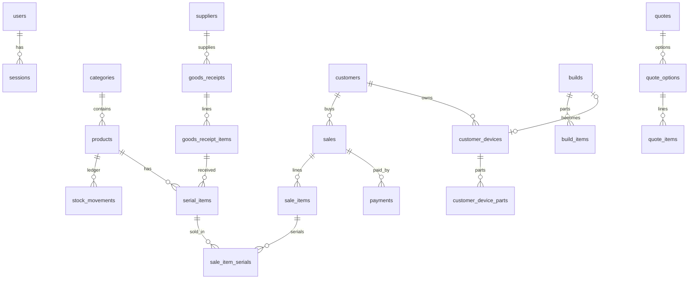

# PC Shop Manager — แผนงาน (Phase 0)

> สถานะ: **ร่าง รอเจ้าของโปรเจกต์อนุมัติ** — ยังไม่มีการเขียนโค้ดแอป
> ส่วนที่ติด ❓ ต้องรอคำตอบจากคุณ (ดูหัวข้อ 1) ส่วนที่ติด 💡 เป็นข้อเสนอที่ต่างจากสเปกเดิมหรือเพิ่มจากสเปกเดิม

---

## สารบัญ
1. [คำถามที่ต้องการคำตอบก่อนเริ่ม Phase 1](#1-คำถามที่ต้องการคำตอบก่อนเริ่ม-phase-1)
2. [ข้อเสนอที่ต่างจาก/เพิ่มจากสเปก](#2-ข้อเสนอที่ต่างจากเพิ่มจากสเปก)
3. [Tech stack และรายการ dependency ที่ขออนุมัติ](#3-tech-stack-และรายการ-dependency-ที่ขออนุมัติ)
4. [โครงสร้างโฟลเดอร์](#4-โครงสร้างโฟลเดอร์)
5. [สถาปัตยกรรมตอนรัน (runtime)](#5-สถาปัตยกรรมตอนรัน-runtime)
6. [Database schema](#6-database-schema)
7. [Business logic หลัก](#7-business-logic-หลัก)
8. [Auth และสิทธิ์ตามบทบาท](#8-auth-และสิทธิ์ตามบทบาท)
9. [API endpoints หลัก](#9-api-endpoints-หลัก)
10. [รายการหน้าจอ](#10-รายการหน้าจอ)
11. [เอกสาร/รูปภาพ และข้อความภาษาไทย](#11-เอกสารรูปภาพ-และข้อความภาษาไทย)
12. [Backup และ Restore](#12-backup-และ-restore)
13. [การทดสอบ](#13-การทดสอบ)
14. [ความเสี่ยงทางเทคนิค](#14-ความเสี่ยงทางเทคนิค)
15. [แผนย่อยของ Phase 1 (1 commit ต่อ 1 งานย่อย)](#15-แผนย่อยของ-phase-1)

---

## 1. คำถามที่ต้องการคำตอบก่อนเริ่ม Phase 1

ทุกข้อมี "ค่าที่ผมแนะนำ" ไว้แล้ว ถ้าคุณตอบว่า "ตามที่แนะนำ" ผมจะใช้ค่านั้นเลย

### คำถามด้านธุรกิจ

**Q1. Build ที่ประกอบเสร็จแล้ววางขาย ควรตัดสต็อกตอนไหน?** ❓
สเปกบอกว่า "preset ไม่ตัดสต็อก" และ "ตัดสต็อกตอนขาย" แต่ก็มีประเภทความเคลื่อนไหว "used in build" และสถานะ serial "in a build" ด้วย ซึ่งสองอย่างนี้จะมีความหมายก็ต่อเมื่อมีการประกอบเครื่องจริงก่อนขาย
- **แนะนำ:** Build มีสถานะ `draft` (ร่าง/preset, ไม่ตัดสต็อก) → `assembled` (ประกอบจริงแล้ว ตัดสต็อกเป็น `build_consume` และ serial เปลี่ยนเป็น `in_build`) → `sold` และถ้าจะรื้อเครื่องทีหลังก็ใช้ `disassembled` เพื่อคืนชิ้นส่วนเข้าสต็อก ถ้าขาย Build ที่ยังเป็น draft ระบบจะตัดสต็อกทุกชิ้นตอนขายไปเลย

**Q2. พนักงานรับสินค้าเข้า แต่ห้ามเห็นต้นทุน แล้วใครเป็นคนกรอกต้นทุนตอนรับของ?** ❓
- (A) พนักงานรับของโดยไม่กรอกต้นทุน ระบบใช้ต้นทุนเฉลี่ยปัจจุบันไปก่อน แล้วเจ้าของมากรอกต้นทุนจริงทีหลัง (ใบรับของจะมีสถานะ "รอใส่ต้นทุน")
- (B) **แนะนำ:** พนักงานกรอกต้นทุนตามใบส่งของได้ แต่เป็นช่อง **write-only** คือบันทึกแล้วดูย้อนหลังไม่ได้ และ API จะไม่ส่งค่านี้กลับไปให้พนักงานเลย วิธีนี้ทำง่ายกว่าและต้นทุนถูกต้องตั้งแต่แรก (พนักงานถือใบส่งของอยู่ในมืออยู่แล้ว) ถ้าต้องการ ผมเพิ่มสวิตช์ในตั้งค่าให้สลับเป็นแบบ A ได้

**Q3. คิดต้นทุนแบบไหน?** ❓
- **แนะนำ:** ต้นทุนเฉลี่ยถ่วงน้ำหนักเคลื่อนที่ (Moving Weighted Average) ต่อสินค้า ทุกครั้งที่รับของเข้า ระบบจะคำนวณต้นทุนเฉลี่ยใหม่ แล้วบรรทัดการขายจะเก็บ snapshot ต้นทุนเฉลี่ย ณ ตอนขาย วิธีนี้ง่ายและเป็นมาตรฐาน ส่วน serial แต่ละตัวก็ยังเก็บต้นทุนจริงของตัวเองไว้อ้างอิง (มีประโยชน์ตอนเคลมและตอนทำ Phase 6 ของมือสอง)
- อีกทางคือเจาะจงต้นทุนราย serial (Specific Identification) ซึ่งแม่นกว่าสำหรับของที่มี serial แต่ทำให้ระบบซับซ้อนขึ้นมาก

**Q4. ร้านจด VAT ไหม และต้องออก "ใบกำกับภาษีเต็มรูป" หรือเปล่า?** ❓
- **แนะนำ:** ถ้าเปิด VAT ใบเสร็จจะใช้หัวว่า "ใบเสร็จรับเงิน/ใบกำกับภาษีอย่างย่อ" และถ้าใส่ชื่อ ที่อยู่ และเลขผู้เสียภาษีของลูกค้าตอนขาย ก็ออกเป็น "ใบกำกับภาษีเต็มรูป" ได้ (พิมพ์บนกระดาษ ไม่เกี่ยวกับ e-Tax) ในโหมด VAT-inclusive ราคาสินค้าที่กรอกในระบบคือราคารวม VAT แล้ว

**Q5. พิมพ์ใบเสร็จด้วยกระดาษแบบไหน?** ❓
สเปกระบุ PNG (ส่ง LINE) กับ PDF แต่ยังไม่ได้บอกเรื่องเครื่องพิมพ์
- **แนะนำ:** PDF ขนาด A4 และ A5 และเพิ่มปุ่ม "พิมพ์" ที่สั่งพิมพ์ผ่าน browser (`window.print`) ถ้าร้านใช้**เครื่องพิมพ์ใบเสร็จความร้อน 80mm/58mm** บอกผมด้วย ผมจะทำ layout แยกให้ (ใช้แค่ CSS `@page` ไม่ต้องเพิ่ม dependency)

**Q6. พนักงานให้ส่วนลดได้ไหม?** ❓
สเปกห้ามพนักงานแก้ราคาขาย แต่ยังไม่ได้พูดถึงส่วนลด
- **แนะนำ:** ได้ แต่ไม่เกินเพดาน % ที่เจ้าของตั้งไว้ในตั้งค่า (ค่าเริ่มต้น 5%) ถ้าเกินเพดาน ระบบจะปฏิเสธที่ server

**Q7. พนักงานเพิ่ม/แก้ไขข้อมูลสินค้าได้ไหม?** ❓
- **แนะนำ:** ได้ แต่แก้ช่องราคาขายและต้นทุนไม่ได้ สินค้าที่พนักงานสร้างจะมีราคาเป็น "รอตั้งราคา" และขายไม่ได้จนกว่าเจ้าของจะตั้งราคา ส่วนการลบ/archive ทำได้เฉพาะเจ้าของ

**Q8. ต้องทำคืนสินค้าบางรายการ/ใบลดหนี้ไหม?** ❓
สเปกพูดถึงแค่การ void ทั้งบิล
- **แนะนำ:** ใน Phase 2 ทำเฉพาะ void ทั้งบิลก่อน การคืนบางรายการ (ใบลดหนี้) ไว้ทำภายหลังถ้าจำเป็น (หมายเหตุ: ถ้าร้านจด VAT การ void ใบกำกับภาษีข้ามเดือนภาษีจะมีประเด็นทางบัญชี ในกรณีนั้นควรใช้ใบลดหนี้แทน)

**Q9. ช่องทางชำระเงิน** ❓
- **แนะนำ:** มีเงินสด (มีช่องคำนวณเงินทอน), โอน/พร้อมเพย์, บัตรเครดิต (เครื่อง EDC ของธนาคาร บันทึกยอดอย่างเดียว) และ "หักมูลค่าเครื่องเก่า" (trade-in credit, ดู 💡P4) โดยบิลหนึ่งรับชำระหลายช่องทางและหลายครั้งได้ จึงรองรับการมัดจำหรือค้างชำระไปในตัว

**Q10. ข้อมูลตัวอย่าง (seed)**
- **แนะนำ:** ในหน้าตั้งค่าครั้งแรก มี checkbox "ใส่ข้อมูลสินค้าตัวอย่าง" และมีปุ่ม "ล้างข้อมูลตัวอย่าง" (ใช้ได้เฉพาะตอนที่ยังไม่มีการขาย) เพื่อไม่ให้ข้อมูลตัวอย่างไปปนกับข้อมูลจริงของร้าน

### คำถามด้านเทคนิค

**Q11. ใช้ npm workspaces แทน pnpm ได้ไหม?** ❓
- **แนะนำ: npm workspaces** เพราะ (1) pnpm 10 บล็อก postinstall script โดยค่าเริ่มต้น ทำให้ต้องตั้ง allowlist ให้ `better-sqlite3`/`esbuild` เอง (2) โครงสร้าง `node_modules` แบบ symlink ของ pnpm มักมีปัญหากับ electron-builder และ native module ใน Phase 7 ส่วนข้อดีเรื่องความเร็วของ pnpm ไม่ค่อยมีผลกับโปรเจกต์ขนาดนี้

**Q12. อนุมัติรายการ dependency ในหัวข้อ 3.2 ไหม?** ❓ (รายการที่ไม่มีในสเปกแต่จำเป็นต้องใช้)

---

## 2. ข้อเสนอที่ต่างจาก/เพิ่มจากสเปก

| # | ข้อเสนอ 💡 | เหตุผล |
|---|---|---|
| P1 | **Hash รหัสผ่านด้วย `node:crypto` scrypt** แทน bcrypt/argon2 | ไม่ต้องใช้ native module เพิ่ม (แพ็ก Electron ง่ายขึ้น) และปลอดภัยเพียงพอ |
| P2 | **Session แบบ cookie เก็บใน SQLite** แทน JWT | เจ้าของปิดบัญชีพนักงานแล้ว session หลุดทันที, ไม่มี token ค้างอยู่ใน localStorage, ทำง่าย |
| P3 | **ซ่อนต้นทุนแบบ whitelist:** response ทุกตัวต้องผ่าน Zod schema ที่แยกตาม role (schema ของพนักงานไม่มีฟิลด์ต้นทุนเลย) และมี **test อัตโนมัติที่ยิงทุก GET endpoint ในฐานะพนักงาน** แล้วค้นทั้ง JSON ว่าไม่มีคีย์ต้องห้ามหลุดมา | ถ้าใช้ blacklist (ลบฟิลด์ทีละตัว) มีโอกาสลืมได้ แต่ whitelist + test จะเตือนทันทีเมื่อเพิ่ม endpoint ใหม่แล้วมีต้นทุนหลุดออกไป |
| P4 | **Trade-in เป็น "ช่องทางชำระเงิน" ไม่ใช่ส่วนลด** | ในทางภาษี การรับซื้อของเก่าคือการซื้อ ไม่ใช่การลดราคาขาย ยอดขายและ VAT จึงต้องคิดเต็มจำนวน ลูกค้าจ่ายสุทธิหลังหักมูลค่าของเก่า และใน Phase 6 ของเก่านั้นจะเข้าสต็อกโดยมีต้นทุนเท่ากับมูลค่าที่หักให้ลูกค้า ทำให้ตัวเลขกำไรถูกต้อง |
| P5 | **ตาราง `payments` แยกจากบิล** | รองรับการชำระหลายช่องทาง, มัดจำ และค้างชำระแล้วมาจ่ายทีหลัง |
| P6 | **แก้ปัญหาเครื่องสแกนบาร์โค้ดตอนแป้นพิมพ์เป็นภาษาไทย** | ถ้า Windows ตั้งแป้นเป็นภาษาไทยอยู่ เครื่องสแกนจะพิมพ์ออกมาเป็น "ๅ/-ภถุ..." แทน "12345..." ระบบจะแปลงอักษรไทยกลับเป็นตัวบนแป้น QWERTY (ตามผัง Kedmanee) ให้อัตโนมัติ เมื่อค้นหาด้วยค่าเดิมแล้วไม่เจอ |
| P7 | **สแกน serial ที่หน้า POS แล้วเพิ่มลงตะกร้าได้เลย** และเลือก serial ให้อัตโนมัติ | ขายเร็วขึ้น และลดโอกาสเลือก serial ผิดตัว |
| P8 | **Audit log** (void, เปลี่ยนราคา, ปรับสต็อก, restore, ตั้งค่า, login) | ให้เจ้าของตรวจย้อนหลังได้ว่าใครทำอะไร และใช้พื้นที่น้อย |
| P9 | **สำรองข้อมูลอัตโนมัติก่อนรัน database migration ทุกครั้ง** | อัปเดตแอปแล้ว migration พัง ข้อมูลก็ยังไม่หาย |
| P10 | **กู้รหัสผ่านเจ้าของแบบออฟไลน์:** แสดง recovery code ครั้งเดียวตอนตั้งค่าครั้งแรก + มีคำสั่ง CLI `npm run reset-password` | ระบบไม่มีอีเมลให้ใช้กู้รหัส ถ้าเจ้าของลืมรหัสจะเข้าระบบไม่ได้เลย |
| P11 | **ตัดบรรทัดข้อความไทยใน canvas เอง** ด้วย `Intl.Segmenter` (มีในเบราว์เซอร์อยู่แล้ว ไม่ต้องเพิ่ม dependency) | Konva ตัดคำโดยดูจากช่องว่าง แต่ภาษาไทยไม่เว้นวรรคระหว่างคำ Konva จึงอาจตัดสระหรือวรรณยุกต์ออกจากพยัญชนะ (สำคัญใน Phase 4) |
| P12 | **แยก Build status (draft/assembled/sold)** ตาม Q1 | สอดคล้องกับประเภท movement "used in build" ในสเปก |
| P13 | ชื่อคอลัมน์เงินลงท้ายด้วย `_satang` เสมอ (`price_satang`) และใน TS ใช้ `priceSatang` | อ่านชื่อแล้วรู้เลยว่าหน่วยเป็นสตางค์ ช่วยกันบั๊กคูณ/หาร 100 ผิด |
| P14 | ไม่ใช้ `sharp` หรือไลบรารีประมวลผลรูปฝั่ง server เลย ให้ client ย่อรูปทั้งตัวเต็มและ thumbnail แล้วอัปโหลดขึ้นมาทั้งคู่ | ลด native dependency และไม่ต้องใช้ CPU ของเครื่องร้าน |

---

## 3. Tech stack และรายการ dependency ที่ขออนุมัติ

### 3.1 ตามสเปก (ถือว่าอนุมัติแล้ว)
TypeScript, React + Vite, Tailwind CSS, shadcn/ui, TanStack Query, React Hook Form + Zod, Fastify, better-sqlite3 + Drizzle ORM, react-konva/Konva (Phase 4), Recharts (Phase 2), promptpay-qr, qrcode, html-to-image, jsPDF, Vitest, @fontsource (ฟอนต์ไทย)

### 3.2 ที่ไม่มีในสเปกแต่จำเป็นต้องใช้ (ขออนุมัติ) ❓

| แพ็กเกจ | ใช้ที่ | ใช้ทำอะไร / ทำไมจำเป็น |
|---|---|---|
| `@fastify/cookie` | server | อ่าน/เขียน session cookie |
| `@fastify/static` | server | เสิร์ฟไฟล์ frontend ที่ build แล้วใน production |
| `@fastify/multipart` | server | อัปโหลดรูป |
| `fastify-type-provider-zod` | server | ใช้ Zod schema จาก `shared/` validate request ใน Fastify ได้โดยตรง (ถ้าไม่ใช้ ก็ต้องเขียน `schema.parse()` เองทุก route) |
| `drizzle-kit` (dev) | server | สร้างไฟล์ SQL migration จาก schema |
| `tsx` (dev) | server | รัน TypeScript ฝั่ง server ตอน dev พร้อม watch |
| `esbuild` (dev) | server | bundle server เป็นไฟล์เดียว (Vite ใช้ esbuild อยู่แล้ว เท่ากับแค่ประกาศเป็น dependency ตรง) |
| `react-router` | web | routing ของหน้าต่างๆ (ในสเปกยังไม่มี router) |
| `@hookform/resolvers` | web | เชื่อม React Hook Form กับ Zod |
| `@tailwindcss/vite` | web | plugin ของ Tailwind v4 |
| dependency ที่ shadcn/ui ติดตั้งมาเอง: `radix-ui`, `class-variance-authority`, `clsx`, `tailwind-merge`, `lucide-react` (ไอคอน), `sonner` (toast), `cmdk` (ช่องค้นหา/combobox) | web | เป็นส่วนหนึ่งของ shadcn/ui อยู่แล้ว |
| `concurrently` (dev) | root | ให้ `npm run dev` รัน server กับ web พร้อมกัน |
| `eslint`, `typescript-eslint`, `eslint-plugin-react-hooks`, `prettier`, `prettier-plugin-tailwindcss` (dev) | root | lint และ format |

**ยังไม่ขอตอนนี้ (จะขออีกทีเมื่อถึง phase นั้น):** `electron`, `electron-builder`, `@electron/rebuild` (Phase 7) และฟอนต์สำหรับโพสต์ใน Phase 4 เช่น Kanit, Prompt (ทั้งคู่ติดตั้งผ่าน @fontsource)

**สิ่งที่ตั้งใจไม่ใช้ dependency เพิ่ม:** hash รหัสผ่าน (ใช้ `node:crypto`), ตั้งเวลา backup (ใช้ `setInterval`), จัดรูปแบบวันที่ไทย/พ.ศ. (ใช้ `Intl.DateTimeFormat` ของ Node/เบราว์เซอร์), แปลงจำนวนเงินเป็นตัวอักษร "บาทถ้วน" (เขียนเองพร้อม test), ตัดคำภาษาไทย (`Intl.Segmenter`), rate limit ตอน login (เขียนเองแบบ in-memory), log (ใช้ pino ที่มากับ Fastify)

---

## 4. โครงสร้างโฟลเดอร์

```
d:\ComputerShop\                       (repo root, npm workspaces)
├── package.json                       workspaces: shared, server, web + สคริปต์ dev/build/start/test/lint
├── tsconfig.base.json
├── eslint.config.js / .prettierrc
├── .gitignore / .gitattributes        (บังคับ LF)
├── CLAUDE.md
├── docs/
│   └── PLAN.md
├── data/                              ← โฟลเดอร์ข้อมูลตอน dev (อยู่ใน .gitignore)
│
├── shared/                            โค้ดที่ใช้ร่วมกันทั้ง client และ server (ไม่ต้อง build, export เป็น TS source)
│   └── src/
│       ├── index.ts
│       ├── money.ts                   satang ⇄ บาท, format, ปัดเศษ (divRound)
│       ├── bahttext.ts                แปลงจำนวนเงินเป็นตัวอักษร เช่น "หนึ่งพันบาทถ้วน"
│       ├── pricing.ts                 คำนวณยอดรวม/ส่วนลด/VAT/กำไร (pure function)
│       ├── datetime.ts                แปลงเวลา UTC ⇄ Asia/Bangkok, พ.ศ., ช่วงเวลา "วันนี้"
│       ├── docNumber.ts               สร้างเลขเอกสารจาก format
│       ├── barcode.ts                 แปลงอักษรไทย (แป้น Kedmanee) → QWERTY
│       ├── permissions.ts             ตารางสิทธิ์ของแต่ละ role + ฟังก์ชัน can()
│       ├── enums.ts                   ค่าคงที่ทั้งหมด (สถานะ, ประเภท movement, ...)
│       ├── schemas/                   Zod schema ของ request/response แยกตามโมดูล
│       │   ├── auth.ts  settings.ts  product.ts  category.ts  stock.ts  ...
│       ├── specs/                     นิยามฟิลด์ spec ของแต่ละหมวด (ใช้ทั้งสร้างฟอร์มและ validate)
│       │   ├── cpu.ts  mainboard.ts  ram.ts  gpu.ts  storage.ts  psu.ts  case.ts  cooler.ts  monitor.ts
│       └── compat/                    (Phase 3) กฎตรวจความเข้ากันได้
│           ├── types.ts  registry.ts
│           └── rules/  cpuSocket.ts  ramType.ts  psuWattage.ts  caseFormFactor.ts ...
│
├── server/
│   ├── drizzle/                       ไฟล์ SQL migration ที่ generate แล้ว (commit เข้า git)
│   ├── scripts/                       reset-password.ts, seed.ts
│   └── src/
│       ├── main.ts                    entry ตอนรันจาก CLI: อ่าน config → startServer()
│       ├── app.ts                     buildApp()/startServer({dataDir, port, host}) ← Electron จะเรียกตัวนี้
│       ├── config.ts                  หา data dir, อ่าน config.json
│       ├── db/
│       │   ├── schema/                Drizzle schema แยกไฟล์ตามโมดูล
│       │   ├── client.ts              เปิด/ปิด/เปิดใหม่ connection (ต้องใช้ตอน restore)
│       │   ├── migrate.ts
│       │   └── seed/                  ข้อมูลตัวอย่าง
│       ├── plugins/                   auth (session + requireRole), error handler, static files
│       ├── lib/                       redact.ts, network.ts (หา LAN IP), files.ts, audit.ts
│       ├── services/                  business logic ที่ใช้ข้ามโมดูล
│       │   ├── stock.service.ts       ← ช่องทางเดียวที่เปลี่ยนสต็อกได้
│       │   ├── numbering.service.ts
│       │   └── backup.service.ts
│       └── modules/                   แต่ละโมดูลมี routes.ts (บาง) + service.ts (logic)
│           ├── auth/  setup/  users/  settings/  files/  categories/  products/
│           ├── suppliers/  goods-receipts/  stock/  serials/  backups/
│           ├── customers/  sales/  dashboard/          (Phase 2)
│           ├── builds/  quotes/  customer-devices/     (Phase 3)
│           ├── posts/                                  (Phase 4)
│           ├── repairs/  claims/                       (Phase 5)
│           └── trade-ins/                              (Phase 6)
│   └── test/                          integration test ด้วย Fastify inject() + SQLite ใน memory
│
└── web/
    ├── index.html  vite.config.ts
    └── src/
        ├── main.tsx  router.tsx  index.css
        ├── components/ui/             component ของ shadcn
        ├── components/                layout, MoneyInput, MoneyText, DateText, ImageUploader, ...
        ├── lib/                       api.ts (fetch wrapper), queryClient.ts, imageResize.ts,
        │                              exportImage.ts (html-to-image + jsPDF), useAuth.ts
        ├── documents/                 (Phase 2+) React component ของเอกสาร: ใบเสร็จ, ใบเสนอราคา, ใบรับซ่อม...
        └── features/                  แยกโฟลเดอร์ตามโมดูล (pages + components + hooks ของโมดูลนั้น)
            ├── setup/  auth/  settings/  users/  products/  categories/
            ├── suppliers/  receiving/  stock/  backups/
            └── pos/  sales/  customers/  dashboard/  builds/  quotes/  posts/  repairs/ ...
```

**เหตุผลที่แยกแบบนี้:** `shared/` มีทั้ง Zod schema และสูตรคำนวณ (pricing, compat rules) หน้าจอจึงแสดงยอดสดได้ด้วยสูตรเดียวกับที่ server ใช้ตรวจตอนบันทึก ตัวเลขฝั่งหน้าจอกับฝั่งฐานข้อมูลจึงตรงกันเสมอ ส่วน `server/src/app.ts` export `startServer()` ไว้ ทำให้ Electron (Phase 7) import ไปเรียกใน process เดียวกันได้เลย

---

## 5. สถาปัตยกรรมตอนรัน (runtime)

### โหมด dev (`npm run dev`)
- `concurrently` รัน 2 process:
  - server: `tsx watch server/src/main.ts` บน port **3300**
  - web: Vite บน port **5173** (ตั้ง `host: true` ให้มือถือเข้าได้) และ proxy `/api` กับ `/uploads` ไปที่ 3300
- data dir ตอน dev = `./data` ที่ root ของ repo

### โหมด production (`npm run build && npm start`)
- `web` build ออกมาเป็น `web/dist/` แบบ static
- `server` ถูก esbuild bundle เป็น `server/dist/main.js` (ยกเว้น `better-sqlite3` ที่เป็น native จึงไม่ bundle) และคัดลอก `server/drizzle/` ไปด้วย
- process เดียว: Fastify listen ที่ `0.0.0.0:3300` เสิร์ฟทั้ง `/api/*`, `/uploads/*` และไฟล์ SPA (URL ไหนที่ไม่ใช่ API จะได้ `index.html` กลับไป)
- data dir ใช้ env `PCSHOP_DATA_DIR` ถ้ามี ถ้าไม่มีใช้ค่าเริ่มต้น `%APPDATA%\PCShopManager` (ตำแหน่งเดียวกับที่ Electron ใช้ใน Phase 7 พอเปลี่ยนเป็นแอป desktop จะได้ไม่ต้องย้ายข้อมูล)

### Data dir (แยกจากโฟลเดอร์แอปเสมอ)
```
PCShopManager/
├── config.json         { "port": 3300 }  (ถ้าไม่มีไฟล์ก็ใช้ค่าเริ่มต้น)
├── shop.db             SQLite (WAL mode) + ไฟล์ -wal, -shm
├── uploads/            รูปภาพ ตั้งชื่อตาม sha256 แบ่งโฟลเดอร์ย่อยตาม 2 ตัวอักษรแรก เช่น uploads/ab/abcd…ef.jpg
├── backups/            ตำแหน่ง backup เริ่มต้น (เปลี่ยนได้ในตั้งค่า เช่นไปที่ D:\ หรือ USB)
├── backup-state.json   เวลาที่ backup สำเร็จล่าสุด (เก็บไว้นอก DB เพราะ restore จะแทนที่ DB ทั้งไฟล์)
└── logs/
```

### ลำดับตอนเริ่มระบบ
1. หา data dir แล้วสร้างโฟลเดอร์ย่อยที่ยังไม่มี
2. เปิด DB: `journal_mode=WAL`, `foreign_keys=ON`, `busy_timeout=5000`
3. ถ้ามี migration ค้างอยู่และ DB มีข้อมูลแล้ว → **backup ก่อน** แล้วค่อยรัน migration
4. ตรวจความถูกต้องของสต็อก (cache เทียบกับ ledger) ถ้าไม่ตรงให้เขียน log เตือน
5. เริ่มตัวตั้งเวลา backup (เช็กทุกชั่วโมงว่าวันนี้ backup แล้วหรือยัง)
6. listen

---

## 6. Database schema

### 6.1 ข้อตกลง
- Primary key: `id INTEGER` autoincrement (ระบบมีร้านเดียว ไม่มี sync จึงไม่จำเป็นต้องใช้ UUID)
- เวลา: `INTEGER` เป็น Unix **milliseconds UTC** (Drizzle `mode: 'timestamp_ms'`) ส่วนใน API ส่งเป็น ISO-8601 UTC string
- เงิน: `INTEGER` หน่วยสตางค์ ชื่อคอลัมน์ลงท้าย `_satang`
- อัตราส่วน/เปอร์เซ็นต์: `INTEGER` หน่วย basis point (7% = 700)
- enum: เก็บเป็น `TEXT` มี `CHECK` constraint (ใช้ Drizzle `text({ enum })`)
- master data (สินค้า ลูกค้า ฯลฯ): ไม่ลบจริง ใช้ `archived_at`
- เอกสารการเงิน: ห้ามลบเด็ดขาด ใช้ `status='voided'` ร่วมกับ `voided_at`, `voided_by`, `void_reason`
- ทุกตารางหลักมี `created_at`, `updated_at` และมี `created_by` เมื่อจำเป็นต้องรู้ว่าใครสร้าง
- snapshot: บรรทัดของเอกสารเก็บชื่อ, SKU, ราคา, ต้นทุน และประกัน ณ เวลาที่ออกเอกสาร

### 6.2 ภาพรวมความสัมพันธ์ (หลัก)



### 6.3 ตาราง Phase 1 — Foundation + Inventory

**users**
| คอลัมน์ | ชนิด | หมายเหตุ |
|---|---|---|
| id | int pk | |
| name | text | ชื่อที่แสดง |
| username | text unique | เก็บเป็นตัวพิมพ์เล็ก |
| password_hash | text | `scrypt$N$r$p$salt$hash` |
| role | text | `owner` \| `staff` (ต้องมี owner ที่ active อย่างน้อย 1 คนเสมอ) |
| is_active | int bool | |
| last_login_at, created_at, updated_at | int | |

**sessions**
| คอลัมน์ | หมายเหตุ |
|---|---|
| id text pk | sha256 ของ token (ใน DB เก็บแค่ hash ส่วน cookie เก็บ token จริง) |
| user_id → users | |
| created_at, last_seen_at, expires_at | หมดอายุแบบ sliding 7 วัน |
| user_agent, ip | ให้เจ้าของดูได้ว่า login จากเครื่องไหน |

**shop_settings** (มีแถวเดียว id=1)
`shop_name`, `logo_file_id → files`, `address`, `phone`, `line_id`, `tax_id`, `branch_label` (เช่น "สำนักงานใหญ่"), `vat_mode` (`off`|`inclusive`|`exclusive`), `vat_rate_bp` (700), `promptpay_id`, `receipt_footer`, `use_buddhist_era` (bool), `allow_negative_stock` (bool), `staff_max_discount_bp`, `staff_can_enter_cost` (bool ตาม Q2), `default_assembly_fee_satang`, `backup_dir`, `backup_keep_count` (ค่าเริ่มต้น 14), `backup_hour` (0–23), `receipt_paper` (`a4`|`a5`|`thermal80`), `updated_at`

**document_sequences**
| คอลัมน์ | หมายเหตุ |
|---|---|
| doc_type text pk | `sale`, `quote`, `goods_receipt`, `adjustment`, `repair`, `claim`, `trade_in` |
| format text | เช่น `RC{YY}{MM}-{SEQ:4}` → `RC6909-0001` (ถ้าเปิดใช้ พ.ศ. `{YY}` จะเป็นปี พ.ศ.) |
| reset_policy | `never` \| `yearly` \| `monthly` |
| current_period text | เช่น `2026-09` |
| last_number int | ขอเลขใหม่ภายใน transaction เดียวกับการสร้างเอกสาร (เลขไม่ข้าม ไม่ซ้ำ ใบที่ void ก็ยังเก็บเลขไว้) |

**files**
`id`, `sha256` (unique, กันไฟล์ซ้ำ), `path`, `thumb_path`, `mime`, `size_bytes`, `width`, `height`, `created_by`, `created_at`

**categories**
`id`, `name` (เช่น "ซีพียู (CPU)"), `kind` (`cpu`|`mainboard`|`ram`|`gpu`|`storage`|`psu`|`case`|`cooler`|`monitor`|`accessory`|`service`|`other`), `sort_order`, `is_system` (หมวดตั้งต้น ห้ามลบ), `archived_at`
→ `kind` เป็นตัวบอกว่าหมวดนี้ใช้ฟอร์ม spec แบบไหนและใช้กฎตรวจความเข้ากันได้ข้อไหน หมวดที่ผู้ใช้สร้างเองจะใช้ kind `other` หรือจะเลือกจับคู่กับ kind ที่มีอยู่ก็ได้

**products**
| คอลัมน์ | หมายเหตุ |
|---|---|
| id, sku (unique), barcode (unique, nullable) | |
| name, brand, category_id → categories | |
| condition | `new` \| `used` |
| price_satang (nullable) | NULL = "รอตั้งราคา" ขายไม่ได้ |
| cost_satang | ต้นทุนเฉลี่ยเคลื่อนที่ **(owner เท่านั้น)** |
| warranty_months | ประกันร้านที่ให้ลูกค้า |
| supplier_warranty_months | ค่าเริ่มต้นเวลารับของ |
| track_stock (bool) | false สำหรับสินค้าบริการ/ค่าแรง |
| serial_required (bool) | |
| min_stock | |
| on_hand | **cache** ของยอดคงเหลือ แก้ได้ทางเดียวคือผ่าน stock.service |
| specs (JSON text) | เช่น `{"socket":"AM5","tdpWatt":65}` |
| notes, created_by, archived_at, created_at, updated_at | |

**product_images**: `product_id`, `file_id`, `sort_order` (PK = product_id + file_id)

**suppliers**: `id`, `name`, `contact_name`, `phone`, `line_id`, `address`, `tax_id`, `notes`, `archived_at`

**goods_receipts** (ใบรับสินค้า)
`id`, `doc_no` (unique), `supplier_id`, `supplier_invoice_no`, `received_at`, `notes`, `status` (`posted`|`voided`), `total_cost_satang` (owner), `created_by`, `voided_at`, `voided_by`, `void_reason`

**goods_receipt_items**
`id`, `goods_receipt_id`, `product_id`, `qty`, `unit_cost_satang` (owner), `line_total_satang` (owner)

**serial_items**
| คอลัมน์ | หมายเหตุ |
|---|---|
| id, product_id, serial_no | unique (product_id, serial_no) |
| status | `in_stock` \| `in_build` \| `sold` \| `in_claim` \| `returned_to_supplier` \| `written_off` |
| unit_cost_satang | ต้นทุนจริงของชิ้นนี้ (owner) |
| goods_receipt_item_id | nullable (ของที่มาจาก trade-in หรือยอดยกมาจะไม่มี) |
| received_at, supplier_warranty_expires_at | |
| build_id | ถ้าอยู่ในเครื่องที่ประกอบแล้ว |
| sold_sale_item_id, sold_at, shop_warranty_expires_at | ใส่ตอนขาย |
| customer_device_id | อยู่ในเครื่องของลูกค้าคนไหน |
| notes | |

**stock_movements** (ledger — แก้/ลบแถวไม่ได้ เพิ่มได้อย่างเดียว)
| คอลัมน์ | หมายเหตุ |
|---|---|
| id, product_id | |
| qty_change | +/− |
| type | `opening` `receive` `sale` `build_consume` `build_release` `adjustment` `return` `trade_in` `void` `repair_use` `claim_out` `claim_in` |
| ref_type, ref_id, ref_doc_no | ชี้กลับไปยังเอกสารต้นทาง |
| unit_cost_satang | owner |
| balance_after | ยอดคงเหลือหลังรายการนี้ (ใช้แสดงในหน้าประวัติ) |
| reason | บังคับกรอกเมื่อเป็น `adjustment` และ `void` |
| performed_by, created_at | |

**stock_movement_serials**: `movement_id`, `serial_item_id` (บอกว่า movement นี้เกี่ยวกับ serial ตัวไหนบ้าง)

**audit_logs**: `id`, `user_id`, `action` (เช่น `sale.void`, `product.price_change`, `backup.restore`), `entity_type`, `entity_id`, `detail` (JSON), `created_at`

### 6.4 ตาราง Phase 2 — POS / ใบเสร็จ

**customers**: `id`, `name`, `phone`, `phone_normalized` (index, ใช้เตือนเมื่อเบอร์ซ้ำ), `line_id`, `tax_id`, `address` (ใช้ออกใบกำกับเต็มรูป), `notes`, `archived_at`, `created_at`

**sales**
| คอลัมน์ | หมายเหตุ |
|---|---|
| id, doc_no (unique) | |
| customer_id (nullable) + customer_name/phone/tax_id/address **snapshot** | |
| sold_at | |
| status | `paid` \| `partial` (ค้างชำระ) \| `voided` |
| items_total_satang | ผลรวมบรรทัด (หลังหักส่วนลดรายบรรทัด) |
| bill_discount_satang | |
| vat_mode, vat_rate_bp | snapshot ของค่าตั้ง ณ ตอนขาย |
| vat_satang, total_satang | |
| paid_satang | ยอดที่ชำระแล้ว (cache ผลรวมจาก payments) |
| total_cost_satang | owner |
| source | `pos` \| `quote` \| `repair` |
| quote_id, repair_job_id (nullable) | |
| is_full_tax_invoice (bool) | ตาม Q4 |
| note, salesperson_id, created_at | |
| voided_at, voided_by, void_reason | |

**sale_items**
| คอลัมน์ | หมายเหตุ |
|---|---|
| id, sale_id, parent_item_id (nullable) | ชิ้นส่วนของ Build จะเป็นลูกของบรรทัด Build |
| kind | `product` \| `build` \| `service` \| `custom` |
| product_id, build_id (nullable) | |
| name_snapshot, sku_snapshot | |
| qty, unit_price_satang, discount_satang, line_total_satang | |
| unit_cost_satang | owner |
| warranty_months | snapshot |
| sort_order | |

> บรรทัด Build ในใบเสร็จ: บรรทัดแม่แสดงชื่อเครื่องกับราคารวม ส่วนบรรทัดลูกแสดงรายการชิ้นส่วน พร้อม serial และประกันของแต่ละชิ้น (บรรทัดลูกไม่แสดงราคา) ต้นทุนของ Build = ผลรวมต้นทุนของบรรทัดลูก

**sale_item_serials**: `sale_item_id`, `serial_item_id`

**payments**
`id`, `sale_id`, `method` (`cash`|`transfer`|`card`|`trade_in_credit`), `amount_satang`, `cash_received_satang`, `change_satang`, `reference` (เลขอ้างอิงการโอน), `paid_at`, `received_by`, `voided_at`

### 6.5 ตาราง Phase 3 — Build / ใบเสนอราคา / อัปเกรด

**customer_devices**: `id`, `customer_id`, `name` (เช่น "เครื่องประกอบ Ryzen 5 7600"), `build_id` (ถ้าร้านประกอบให้), `sale_id`, `notes`, `created_at`

**customer_device_parts**: `id`, `device_id`, `category_kind`, `description`, `product_id` (nullable), `serial_item_id` (nullable), `specs` (JSON, ใช้ตรวจความเข้ากันได้ตอนอัปเกรด), `installed_at`, `removed_at` (ประวัติการอัปเกรด ไม่ลบแถวทิ้ง)

**builds**
| คอลัมน์ | หมายเหตุ |
|---|---|
| id, name | |
| type | `new` \| `upgrade` |
| status | `draft` \| `assembled` \| `sold` \| `disassembled` \| `cancelled` |
| is_preset (bool) | เก็บไว้เป็นชุดสเปกสำหรับใช้ซ้ำหรือทำโพสต์ |
| customer_id, customer_device_id | ใช้กับ type upgrade |
| labor_fee_satang, discount_satang | |
| items_total_satang, total_satang | |
| total_cost_satang | owner |
| compat_acknowledged (JSON) | รหัสกฎที่ผู้ใช้กดยืนยันข้ามคำเตือน |
| sold_sale_id, notes, created_by, created_at, updated_at | |

**build_items**: `id`, `build_id`, `product_id`, `qty`, `unit_price_satang` (snapshot), `unit_cost_satang` (snapshot, owner), `serial_item_id` (เลือกตอนประกอบหรือตอนขาย), `sort_order`

**build_removed_parts** (สำหรับอัปเกรด): `id`, `build_id`, `device_part_id` (nullable), `description`, `trade_in_value_satang`

**build_photos**: `build_id`, `file_id`, `sort_order`

**quotes**: `id`, `doc_no`, `customer_id` + customer snapshot, `issued_at`, `expires_at`, `status` (`draft`|`sent`|`accepted`|`expired`|`cancelled`), `accepted_option_id`, `converted_sale_id`, `note`, `created_by`
→ สถานะ `expired` คำนวณตอนอ่านข้อมูล (ถ้าเลย expires_at ไปแล้ว) ไม่ต้องมี cron คอยอัปเดต

**quote_options**: `id`, `quote_id`, `label` (เช่น "ตัวเลือก A: อัปเกรด"), `sort_order`, `source_build_id`, `items_total_satang`, `labor_fee_satang`, `discount_satang`, `vat_satang`, `total_satang`, `trade_in_credit_satang`, `total_cost_satang` (owner)

**quote_items**: เหมือน `sale_items` แต่ผูกกับ `option_id` (copy บรรทัดมาจาก Build ดังนั้นแก้ Build ทีหลังจะไม่ทำให้ใบเสนอราคาเปลี่ยน)

### 6.6 ตาราง Phase 4–6 (โครงคร่าวๆ รายละเอียดจะเสนออีกครั้งตอนเริ่ม phase นั้น)

- **post_templates**: `id`, `name`, `size` (`square`|`portrait`|`story`), `design_json`, `is_builtin`, `created_by`
- **post_designs**: `id`, `name`, `size`, `template_id`, `product_id`, `build_id`, `design_json`, `preview_file_id`, `updated_at`
  - `design_json` = `{ width, height, background, elements: [{ id, type: 'text'|'image'|'rect'|'ellipse'|'badge', x, y, width, height, rotation, props, binding? }] }` โดย binding เป็น placeholder เช่น `{{price}}`
- **repair_jobs**: `id`, `doc_no`, `customer_id`, `customer_device_id`, `problem`, `accessories`, `device_password` (ซ่อนจากหน้า list และ**ลบอัตโนมัติเมื่อคืนเครื่องแล้ว**), `estimated_price_satang`, `technician_id`, `status`, `received_at`, `promised_at`, `completed_at`, `returned_at`, `sale_id`
- **repair_status_history**, **repair_photos**, **repair_parts** (ตัดสต็อกเป็น `repair_use`), **repair_labor**
- **warranty_claims**: `id`, `doc_no`, `serial_item_id`, `customer_id`, `sale_id`, `supplier_id`, `problem`, `status` (`received`|`sent_to_supplier`|`returned`|`replaced`|`rejected`), `sent_at`, `returned_at`, `replacement_serial_item_id`, `notes`
- **trade_ins**: `id`, `doc_no`, ข้อมูลผู้ขาย (ชื่อ, เบอร์, ที่อยู่, **เลขบัตรประชาชน/รูปบัตร** — ร้านค้าของเก่าต้องบันทึกข้อมูลผู้ขายตาม พ.ร.บ. ควบคุมการขายทอดตลาดและค้าของเก่า ผมจะยืนยันรายละเอียดกับคุณอีกครั้งตอนทำ Phase 6), `purchased_at`, `total_satang`, `payment_method`, `status`, `sale_id` (ถ้าใช้เป็นเครดิต)
- **trade_in_items**, **trade_in_photos**, **breakdowns** (แยกเครื่องมือสองเป็นชิ้นส่วน พร้อมกำหนดสัดส่วนต้นทุน)

---

## 7. Business logic หลัก

### 7.1 Stock ledger
- **ช่องทางเดียว** ที่เปลี่ยนสต็อกได้คือ `stockService.move(tx, { productId, qtyChange, type, ref, serialIds, unitCost, reason, userId })` ซึ่งทำงานต่อไปนี้ใน transaction เดียว:
  1. อ่าน `on_hand` ปัจจุบัน
  2. ตรวจว่าจะติดลบไหม (ถ้า `allow_negative_stock` = false ห้ามติดลบ ส่วนสินค้าที่มี serial ห้ามติดลบในทุกกรณี)
  3. insert `stock_movements` พร้อม `balance_after`
  4. update `products.on_hand`
  5. update สถานะของ serial ที่เกี่ยวข้อง
- better-sqlite3 ทำงานแบบ **synchronous** transaction จึงไม่ถูกขัดกลางคัน ถ้ามีสองเครื่องขายชิ้นสุดท้ายพร้อมกัน ใครมาทีหลังจะได้ error "สินค้าไม่พอ" แน่นอน ⚠️ ข้อห้าม: ห้ามใช้ `await` ภายใน transaction
- **Invariant ที่ต้องเป็นจริงเสมอ:**
  - `products.on_hand = SUM(stock_movements.qty_change)`
  - สินค้าที่มี serial: `on_hand = COUNT(serial_items WHERE status='in_stock')`
  - มี endpoint `GET /api/stock/integrity` (owner) ตรวจทั้งสองข้อ ระบบรันตรวจตอนเริ่มทุกครั้ง และมี test ครอบไว้

### 7.2 ต้นทุน (ตาม Q3: Moving Weighted Average)
- ตอนรับของ: `newAvg = divRound(onHand × avg + qty × unitCost, onHand + qty)` ถ้า `onHand ≤ 0` ให้ `newAvg = unitCost`
- ตอน void ใบรับของ: คำนวณย้อนกลับ ถ้าได้ค่าไม่สมเหตุสมผล (ติดลบ หรือ on_hand เหลือ 0) จะคงค่าเดิมไว้แล้วบันทึกลง audit log
- บรรทัดขาย/Build/ใบเสนอราคา snapshot `unit_cost_satang` = ต้นทุนเฉลี่ย ณ ตอนนั้น

### 7.3 การคำนวณยอด (`shared/pricing.ts`, pure function พร้อม unit test)
```
lineGross   = unitPrice × qty
lineNet     = lineGross − lineDiscount                (ส่วนลดแบบ % แปลงเป็นสตางค์ตั้งแต่ตอนกรอก)
itemsTotal  = Σ lineNet
afterDisc   = itemsTotal − billDiscount

vat off       : vat = 0;                                     total = afterDisc
vat inclusive : vat = divRound(afterDisc × r, 10000 + r);    total = afterDisc
vat exclusive : vat = divRound(afterDisc × r, 10000);        total = afterDisc + vat
(r = vat_rate_bp เช่น 700, divRound = ปัดครึ่งขึ้นด้วยเลขจำนวนเต็ม)

revenueExVat = total − vat
profit       = revenueExVat − Σ(unitCost × qty)              (owner เท่านั้น)
amountDue    = total − Σ payments(ไม่รวมที่ void)            (trade_in_credit นับเป็น payment)
```
- ส่วนลดท้ายบิลจะถูกกระจายลงแต่ละบรรทัดตามสัดส่วน (ใช้ largest remainder ทำให้ผลรวมตรงเป๊ะ) เพื่อให้คำนวณกำไรรายสินค้าในรายงานสินค้าขายดีได้

### 7.4 เลขเอกสาร
- ขอเลขใหม่ภายใน transaction เดียวกับการสร้างเอกสาร โดยตัดรอบ (เดือน/ปี) ตาม**วันที่เวลาไทย**
- token ที่ใช้ได้: `{YYYY}` `{YY}` (เป็น พ.ศ. หรือ ค.ศ. ตามการตั้งค่า), `{MM}`, `{DD}`, `{SEQ:n}`

### 7.5 Void
- ทำได้เฉพาะ owner, บังคับกรอกเหตุผล และทุกขั้นตอนอยู่ใน transaction เดียว
- ขั้นตอน: เปลี่ยนสถานะเอกสาร → คืนสต็อก (movement type `void`) → คืนสถานะ serial → void payments → บันทึก audit log
- void ใบรับของได้ก็ต่อเมื่อของล็อตนั้นยังไม่ถูกขายออกไป (serial ยังเป็น `in_stock` และ on_hand เหลือพอ)

### 7.6 วงจรชีวิตของ serial
```
รับเข้า → in_stock ──ประกอบ──→ in_build ──ขาย──→ sold ──เคลม──→ in_claim → sold (ได้ตัวเดิมคืน)
             │                    └──รื้อ──→ in_stock                    └→ ได้ตัวใหม่: ตัวเดิม returned_to_supplier, ตัวใหม่ sold
             ├──ปรับสต็อกออก──→ written_off
             └──void ใบขาย──→ in_stock
```

### 7.7 เวลา
- เวลาไทยคือ UTC+7 และไม่มี daylight saving จึงคำนวณขอบเขต "วันนี้"/"เดือนนี้" ได้แน่นอนด้วย offset คงที่ (`shared/datetime.ts`)
- แสดงผลด้วย `Intl.DateTimeFormat('th-TH-u-ca-buddhist' | 'th-TH-u-ca-gregory', { timeZone: 'Asia/Bangkok' })`
- query ที่จัดกลุ่มตามวันใน SQLite: `date(sold_at/1000, 'unixepoch', '+7 hours')`

---

## 8. Auth และสิทธิ์ตามบทบาท

### 8.1 Authentication
- ตอนเริ่มครั้งแรก ถ้ายังไม่มี user เลย ทุก route จะพาไปที่ `/setup`, endpoint `POST /api/setup` ใช้ได้**เฉพาะตอนที่ยังไม่มี user** และจะแสดง recovery code ครั้งเดียว
- Login → สร้าง token สุ่ม 32 bytes → ใส่ใน cookie `sid` (`HttpOnly`, `SameSite=Lax`, ไม่ใส่ `Secure` เพราะใน LAN ใช้ http) และใน DB เก็บเฉพาะ hash ของ token
- **ป้องกัน CSRF:** request ที่ไม่ใช่ GET ต้องมี header `X-PCShop: 1` (เว็บจากโดเมนอื่นใส่ header นี้ไม่ได้ถ้าไม่ผ่าน CORS preflight ซึ่งเราไม่เปิดให้) ร่วมกับ SameSite=Lax
- จำกัดจำนวนครั้ง login ผิด: ผิด 5 ครั้งภายใน 5 นาทีต่อ username+IP → ล็อก 5 นาที
- ปิดบัญชีพนักงาน → ลบ session ของคนนั้นทั้งหมดทันที
- `/uploads/*` ต้อง login ก่อนถึงจะเปิดดูได้ (same-origin และส่ง cookie ไปด้วย ทำให้ canvas ของ Konva/html-to-image ไม่ติดปัญหา tainted)

### 8.2 ตารางสิทธิ์ (`shared/permissions.ts`)
| การกระทำ | Owner | Staff |
|---|:-:|:-:|
| ดูต้นทุน / กำไร / มูลค่าสต็อก / ยอดรวมต้นทุนในใบรับของ | ✅ | ❌ |
| เพิ่ม/แก้ไขสินค้า (ยกเว้นราคาขาย/ต้นทุน) | ✅ | ✅ (Q7) |
| ตั้ง/แก้ราคาขาย และต้นทุน | ✅ | ❌ |
| Archive สินค้า/หมวดหมู่/ลูกค้า/ผู้จำหน่าย | ✅ | ❌ |
| รับสินค้าเข้า | ✅ | ✅ (ต้นทุนเป็น write-only ตาม Q2) |
| void ใบรับของ / ปรับสต็อก | ✅ | ❌ |
| ขาย ออกใบเสร็จ รับชำระเพิ่ม | ✅ | ✅ |
| ให้ส่วนลด | ✅ ไม่จำกัด | ✅ ไม่เกินเพดาน (Q6) |
| void บิลขาย | ✅ | ❌ |
| Build / ใบเสนอราคา / แปลงเป็นการขาย / ทำโพสต์ | ✅ | ✅ |
| ลบ draft ของตัวเอง (Build/ใบเสนอราคา) | ✅ | ✅ |
| งานซ่อม / เคลม | ✅ | ✅ |
| ตั้งค่าร้าน, จัดการผู้ใช้, backup/restore, audit log | ✅ | ❌ |
| ดู URL สำหรับมือถือ + QR | ✅ | ✅ |

### 8.3 การซ่อนต้นทุนที่ server (สำคัญที่สุด)
1. สำหรับข้อมูลทุกประเภทที่มีต้นทุน `shared/schemas` จะมี schema 2 แบบ ได้แก่ `xxxStaffSchema` (ไม่มีฟิลด์ต้นทุน) และ `xxxOwnerSchema = xxxStaffSchema.extend({...cost fields})`
2. route ส่งข้อมูลกลับผ่าน `respondByRole(req, { owner, staff }, data)` ซึ่ง `parse` ด้วย schema ของ role นั้น Zod ตัดคีย์ที่ไม่อยู่ใน schema ทิ้งอัตโนมัติ **ถ้าลืมใส่ฟิลด์ใน schema ฟิลด์นั้นจะไม่ถูกส่งออกไป** (ผิดพลาดแล้วยังปลอดภัยอยู่)
3. รายชื่อคีย์ต้องห้ามอยู่ใน `shared/permissions.ts`: `costSatang`, `unitCostSatang`, `totalCostSatang`, `lineCostSatang`, `profitSatang`, `marginBp`, `inventoryValueSatang` …
4. **Integration test:** seed ข้อมูลครบทุกประเภท → login เป็น staff → ยิงทุก GET route ที่ลงทะเบียนไว้ (ดึงรายชื่อ route จาก Fastify อัตโนมัติ) → ค้นทั้ง JSON response แบบ recursive ว่าไม่มีคีย์ต้องห้าม ถ้า route ใหม่ไม่ได้ผ่าน test นี้ ถือว่า CI ไม่ผ่าน
5. ช่องทางรั่วทางอ้อมที่ต้องปิด: การ sort/filter ด้วยต้นทุน, dashboard, ประวัติ stock movement, รายละเอียดใบรับของ, การดาวน์โหลดไฟล์ backup (ทั้งหมดนี้ owner เท่านั้น), ข้อมูลที่ใช้เติมโพสต์ (ใช้แค่ราคาขาย) และข้อความ error

---

## 9. API endpoints หลัก

ข้อตกลง: prefix `/api`, รับส่ง JSON, error มีรูปแบบ `{ error: { code: 'INSUFFICIENT_STOCK', message: 'สินค้าคงเหลือไม่พอ', details? } }`, list endpoint คืน `{ items, total }` และรับ `?page=&pageSize=&q=`
🔒 = owner เท่านั้น, (ต) = ตัดฟิลด์ต้นทุนออกเมื่อเป็น staff

### Phase 1
| Method | Path | หมายเหตุ |
|---|---|---|
| GET | /setup/status | ติดตั้งแล้วหรือยัง |
| POST | /setup | สร้าง owner + ข้อมูลร้าน + (option) seed คืน recovery code |
| POST | /auth/login · /auth/logout | |
| GET | /auth/me | user + permissions |
| POST | /auth/change-password | |
| GET/POST | /users 🔒 | |
| PATCH | /users/:id 🔒 | แก้ชื่อ, role, active |
| POST | /users/:id/reset-password 🔒 | |
| GET | /settings | staff ได้เฉพาะส่วนที่จำเป็นต่อการขาย (ชื่อร้าน, VAT, พร้อมเพย์, เพดานส่วนลด ...) |
| PATCH | /settings 🔒 | |
| GET/PATCH | /settings/sequences 🔒 | รูปแบบเลขเอกสาร |
| GET | /system/network | รายการ LAN URL (สร้าง QR ที่ฝั่ง client) |
| GET | /system/info | เวอร์ชัน, data dir 🔒 |
| POST | /files | อัปโหลด (multipart: image + thumb) |
| GET | /uploads/:path | ต้อง login |
| GET/POST/PATCH | /categories · /categories/:id | |
| POST | /categories/:id/archive 🔒 | |
| GET | /products (ต) | `q`, `categoryId`, `condition`, `stock=low\|out\|in`, `sort` |
| GET | /products/lookup?code= (ต) | ค้นด้วยบาร์โค้ด/SKU/serial แบบตรงตัว (ใช้กับเครื่องสแกน) |
| GET/POST/PATCH | /products/:id (ต) | server ตรวจว่า staff ไม่ได้แก้ราคา/ต้นทุน |
| POST | /products/:id/archive 🔒 | |
| PUT | /products/:id/images | กำหนดลำดับรูป |
| GET | /products/:id/movements (ต) | |
| GET | /products/:id/serials (ต) | |
| GET | /spec-definitions | นิยามฟอร์ม spec ของแต่ละ kind (หรือ import จาก shared โดยตรงก็ได้) |
| GET/POST/PATCH | /suppliers · /suppliers/:id | |
| GET/POST | /goods-receipts · /goods-receipts/:id (ต) | POST = บันทึกและรับเข้าสต็อกทันที |
| POST | /goods-receipts/:id/void 🔒 | |
| POST | /stock/adjustments 🔒 | ต้องมีเหตุผล, ถ้าเป็นสินค้ามี serial ต้องระบุ serial |
| GET | /stock/movements (ต) | filter: สินค้า, ประเภท, ช่วงวันที่ |
| GET | /stock/integrity 🔒 | |
| GET | /serials?q= (ต) | ค้นหา serial |
| GET/POST | /backups 🔒 | รายการ / สำรองเดี๋ยวนี้ |
| POST | /backups/restore 🔒 | `{ backupId }` หรือ `{ path }` |
| POST | /seed/clear 🔒 | ล้างข้อมูลตัวอย่าง (ใช้ได้เฉพาะตอนยังไม่มีการขาย) |
| GET | /audit-logs 🔒 | |

### Phase 2
| Method | Path | หมายเหตุ |
|---|---|---|
| GET/POST/PATCH | /customers · /customers/:id | ค้นด้วยชื่อหรือเบอร์ |
| GET | /customers/:id/history (ต) | ประวัติซื้อ, เครื่อง, งานซ่อม |
| POST | /sales/quote-totals | คำนวณยอดโดยไม่บันทึก (หน้าจอคำนวณเองด้วย shared ก็ได้ endpoint นี้ใช้ยืนยัน) |
| POST | /sales | สร้างบิล + ตัดสต็อก + payments ใน transaction เดียว |
| GET | /sales (ต) · /sales/:id (ต) | `/sales/:id` คืนข้อมูลครบสำหรับ render ใบเสร็จ |
| POST | /sales/:id/payments | รับชำระเพิ่ม |
| POST | /sales/:id/void 🔒 | |
| GET | /dashboard/summary?from=&to= (ต) | ยอดขาย, กราฟรายวัน, สินค้าขายดี, สินค้าใกล้หมด, และสำหรับ owner เพิ่มกำไรกับมูลค่าสต็อก |

### Phase 3
| Method | Path | หมายเหตุ |
|---|---|---|
| GET/POST/PATCH/DELETE | /builds · /builds/:id (ต) | DELETE ใช้ได้เฉพาะ draft |
| POST | /builds/check-compat | ส่งรายการชิ้นส่วนมา คืน warnings |
| POST | /builds/:id/assemble · /builds/:id/disassemble | ตาม Q1 |
| POST | /builds/:id/duplicate · /builds/:id/refresh-prices | |
| GET/POST/PATCH | /customer-devices · /customer-devices/:id | |
| GET/POST/PATCH | /quotes · /quotes/:id (ต) | |
| POST | /quotes/:id/status | |
| POST | /quotes/:id/convert | `{ optionId, payments[] }` ตรวจสต็อกก่อน แล้วสร้าง sale |

### Phase 4–6 (คร่าวๆ)
- `/post-templates`, `/post-designs`, `GET /post-context?productId=|buildId=` (คืนเฉพาะข้อมูลที่เปิดเผยได้ ไม่มีต้นทุน)
- `/repairs`, `/repairs/:id/status`, `/repairs/:id/parts`, `/repairs/:id/close` (→ สร้าง sale)
- `GET /warranty/lookup?serial=|phone=`, `/claims`, `/claims/:id/status`
- `/trade-ins`, `/trade-ins/:id/breakdown`

---

## 10. รายการหน้าจอ

layout: บน desktop มี sidebar ด้านซ้าย บนมือถือมี bottom nav (เช็กสต็อก / ถ่ายรูป / งานซ่อม / เมนู) ที่ header มีปุ่ม "เปิดบนมือถือ" แสดง QR

| Phase | หน้าจอ | Path | คำอธิบาย | อุปกรณ์หลัก |
|---|---|---|---|---|
| 1 | ตั้งค่าครั้งแรก | /setup | wizard: บัญชีเจ้าของ → ข้อมูลร้าน → ข้อมูลตัวอย่าง → recovery code | desktop |
| 1 | เข้าสู่ระบบ | /login | | ทั้งคู่ |
| 1 | หน้าแรก | / | Phase 1 เป็นทางลัดไปหน้าต่างๆ, Phase 2 เปลี่ยนเป็น dashboard | ทั้งคู่ |
| 1 | สินค้า | /products | ตาราง + ค้นหา + filter หมวด/สภาพ/สต็อก (ยอดคงเหลือต่ำกว่า min แสดงเป็นสีแดง) | desktop |
| 1 | เพิ่ม/แก้ไขสินค้า | /products/new, /products/:id/edit | ฟอร์มหลัก + ฟอร์ม spec ที่เปลี่ยนตามหมวด + รูป | desktop |
| 1 | รายละเอียดสินค้า | /products/:id | ข้อมูล, แท็บ serial, แท็บประวัติความเคลื่อนไหว | ทั้งคู่ |
| 1 | เช็กสต็อก | /stock/lookup | ช่องค้นหาใหญ่ แสดงผลเป็นการ์ด (ยอดคงเหลือ + ราคา) | **มือถือ** |
| 1 | หมวดหมู่ | /categories | | desktop |
| 1 | ผู้จำหน่าย | /suppliers | | desktop |
| 1 | รับสินค้าเข้า | /receiving, /receiving/new | เพิ่มสินค้าทีละบรรทัด, ช่องสแกน serial (สแกนแล้วขึ้นบรรทัดใหม่อัตโนมัติ, นับจำนวนให้) | desktop |
| 1 | ปรับสต็อก | /stock/adjust 🔒 | | desktop |
| 1 | ความเคลื่อนไหวสต็อก | /stock/movements | ภาพรวมทุกสินค้า + filter | desktop |
| 1 | ตั้งค่า › ข้อมูลร้าน | /settings/shop 🔒 | ข้อมูลร้าน, โลโก้, VAT, พร้อมเพย์, footer | desktop |
| 1 | ตั้งค่า › เลขเอกสาร | /settings/numbering 🔒 | | desktop |
| 1 | ตั้งค่า › ผู้ใช้งาน | /settings/users 🔒 | | desktop |
| 1 | ตั้งค่า › สำรอง/กู้คืน | /settings/backup 🔒 | ตั้งค่าตำแหน่ง, จำนวนที่เก็บ, "สำรองเดี๋ยวนี้", รายการ backup + กู้คืน | desktop |
| 1 | ตั้งค่า › เชื่อมต่อมือถือ | /settings/network | LAN URL + QR ขนาดใหญ่ + คำแนะนำเรื่อง Firewall | ทั้งคู่ |
| 1 | บัญชีของฉัน | /account | เปลี่ยนรหัสผ่าน | ทั้งคู่ |
| 2 | ขายสินค้า (POS) | /pos | ช่องค้นหา/สแกนที่ focus อยู่ตลอด, ตะกร้า, เลือก serial, ส่วนลด, ลูกค้า, ชำระเงิน | desktop |
| 2 | ประวัติการขาย | /sales, /sales/:id | ดู/export ใบเสร็จ PNG/PDF, พิมพ์, รับชำระเพิ่ม, void | desktop |
| 2 | ลูกค้า | /customers, /customers/:id | ประวัติ, เครื่องของลูกค้า | ทั้งคู่ |
| 2 | Dashboard | / | | desktop |
| 3 | จัดสเปก (Build) | /builds, /builds/:id | เลือกชิ้นส่วนตามหมวด, คำเตือนความเข้ากันได้, ยอดสด | desktop |
| 3 | ใบเสนอราคา | /quotes, /quotes/:id | หลายตัวเลือกเทียบกัน, export, แปลงเป็นการขาย | desktop |
| 3 | คำนวณอัปเกรด | /upgrade | wizard 5 ขั้นตามสเปก | desktop |
| 4 | โพสต์ขาย | /posts, /posts/:id | แกลเลอรี + editor | desktop (อัปรูปจากมือถือได้) |
| 5 | งานซ่อม | /repairs, /repairs/new, /repairs/:id | กระดานสถานะ | **มือถือ** |
| 5 | ประกัน/เคลม | /warranty, /claims | | ทั้งคู่ |
| 6 | รับซื้อ/เทิร์น | /trade-ins, /trade-ins/new | | ทั้งคู่ |

---

## 11. เอกสาร/รูปภาพ และข้อความภาษาไทย

- **ฟอนต์:** ผ่าน `@fontsource` ทั้งหมด UI ใช้ IBM Plex Sans Thai หรือ Noto Sans Thai (variable) ส่วนเอกสารใช้ Sarabun
- **ใบเสร็จ/ใบเสนอราคา/ใบรับซ่อม:** เป็น React component ที่ใช้ `DocumentLayout` ร่วมกัน → render ลงใน DOM ที่ซ่อนไว้ → `await document.fonts.ready` → `html-to-image` สร้าง PNG (`pixelRatio: 2`) และคำนวณ `fontEmbedCSS` ไว้ครั้งเดียวแล้วใช้ซ้ำ → PDF ใช้ jsPDF `addImage` (ถ้ายาวเกิน 1 หน้าให้แบ่งหน้า)
  - PNG สำหรับส่ง LINE: กว้าง 1080px (layout 540px × pixelRatio 2) ความสูงยืดตามเนื้อหา
  - มีปุ่ม **ดาวน์โหลด** เป็นช่องทางหลักเสมอ (บนมือถือที่เปิดผ่าน http ใช้ Clipboard/Share API ไม่ได้)
- **Konva (Phase 4):** รอให้ฟอนต์โหลดเสร็จ (`document.fonts.load`) ก่อน render และตัดบรรทัดเองด้วย `Intl.Segmenter('th', { granularity: 'word' })` ร่วมกับการวัดความกว้างด้วย `measureText` แล้วค่อยส่งข้อความที่ตัดบรรทัดแล้วเข้า Konva. ถ้าต้องตัดข้อความให้สั้นลง ให้ตัดตามขอบเขต grapheme เพื่อไม่ให้สระ/วรรณยุกต์หลุดออกจากพยัญชนะ
- **ข้อความทดสอบมาตรฐาน:** `ผู้ใหญ่ น้ำแข็ง ที่นี่ ฟรี!` ใช้ทดสอบในทุกจุดที่ export
- **อัปโหลดรูป:** `<input type="file" accept="image/*" capture="environment">` → ย่อรูปฝั่ง client ด้วย canvas ให้ด้านยาวไม่เกิน 1600px, JPEG คุณภาพ 0.82 (โลโก้ใช้ PNG เพื่อรักษาพื้นหลังโปร่งใส) และทำ thumbnail 320px → ส่งทั้งสองไฟล์ในคำขอเดียว → server ตรวจ magic bytes, จำกัดขนาด ≤ 5MB, ตั้งชื่อด้วย sha256 (ถ้ามีไฟล์เดิมอยู่แล้วไม่ต้องเก็บซ้ำ)
- ⚠️ **http ใน LAN ไม่นับเป็น secure context:** จึงใช้ `getUserMedia`, `navigator.clipboard`, `navigator.share` และ **`crypto.randomUUID()`** บนมือถือไม่ได้ ถ้าต้องสร้าง id ฝั่ง client ให้ใช้ `crypto.getRandomValues` แทน (ใช้ได้ใน insecure context)
- **เครื่องสแกนบาร์โค้ด:** ช่องค้นหาใน POS รับ Enter → เรียก `/products/lookup?code=` ถ้าเจอตรงตัวให้เพิ่มลงตะกร้าและล้างช่องทันที ถ้าไม่เจอให้ลองแปลงผังแป้นไทย → QWERTY แล้วค้นอีกรอบ (P6)

---

## 12. Backup และ Restore

**รูปแบบ backup** (1 โฟลเดอร์ต่อ 1 ครั้ง):
```
<backup_dir>/pcshop-backup-2026-09-10_2300/
├── shop.db          ← สร้างด้วย better-sqlite3 db.backup() (SQLite online backup API ปลอดภัยแม้ DB กำลังถูกใช้งาน)
├── uploads/         ← คัดลอกทั้งโฟลเดอร์
└── manifest.json    { appVersion, schemaVersion, createdAt, productCount, saleCount, sizeBytes, ok: true }
```
- เขียนลงโฟลเดอร์ชั่วคราว `….partial` ก่อน เสร็จแล้วค่อย rename เพื่อไม่ให้ backup ที่ทำไม่เสร็จปนอยู่ในรายการ
- **อัตโนมัติ:** ระบบเช็กทุกชั่วโมง ถ้าถึงชั่วโมงที่ตั้งไว้ (`backup_hour`) และวันนี้ยังไม่ได้ backup ก็ทำเลย (ถ้าคอมปิดอยู่ตอนถึงเวลา จะ backup ครั้งถัดไปที่เปิดเครื่อง) หลัง backup สำเร็จจะลบ backup เก่าจนเหลือ N ชุดล่าสุด (เก็บใน `backup-state.json`)
- **Restore (owner):**
  1. ตรวจ backup: เปิดแบบ read-only → `PRAGMA integrity_check` → ต้องมี `schemaVersion ≤` เวอร์ชันของแอป (ถ้า backup มาจากแอปเวอร์ชันที่ใหม่กว่า ระบบจะปฏิเสธ)
  2. **backup สถานะปัจจุบันก่อนเสมอ** (เป็นตาข่ายกันพลาด)
  3. หยุดรับ request ชั่วคราว → ปิด DB connection → แทนที่ `shop.db` (ลบ `-wal`/`-shm` ด้วย) และโฟลเดอร์ `uploads/`
  4. เปิด DB ใหม่ → รัน migration (กรณี backup มาจากเวอร์ชันเก่า) → ตรวจ integrity ของสต็อก
  5. session ทั้งหมดใช้ไม่ได้แล้ว ทุกคนต้อง login ใหม่
- มี test อัตโนมัติ: สร้างข้อมูล → backup → แก้ข้อมูล → restore → ข้อมูลต้องกลับมาตรงกับตอน backup

---

## 13. การทดสอบ

- **Unit (Vitest, `shared/`):** money, divRound, bahttext, pricing (ส่วนลด, VAT ทั้ง 3 โหมด, การปัดเศษ, กระจายส่วนลด), docNumber, datetime (ขอบวันตามเวลาไทย), barcode (แปลงแป้นไทย), compat rules
- **Integration (Vitest + Fastify `inject()` + SQLite in-memory, `server/test/`):** stock ledger (รับของ/ขาย/void/ปรับ ทุกกรณีต้องรักษา invariant), serial lifecycle, ห้ามสต็อกติดลบ, สิทธิ์แต่ละ endpoint, **ต้นทุนไม่หลุดไปถึง staff**, backup/restore, เลขเอกสารไม่ซ้ำ
- **Manual:** ทุก phase จะมี checklist ให้คุณทดสอบทีละขั้นตอน (รวมการทดสอบบนมือถือจริง)
- ยังไม่ทำ E2E/browser test (ต้องใช้ Playwright ซึ่งเป็น dependency ใหม่ ถ้าอยากได้ค่อยคุยกันทีหลัง)

---

## 14. ความเสี่ยงทางเทคนิค

| # | ความเสี่ยง | ผลกระทบ | วิธีรับมือ |
|---|---|---|---|
| R1 | **Konva ตัดบรรทัดข้อความไทยผิด** (ภาษาไทยไม่เว้นวรรคระหว่างคำ) | สระ/วรรณยุกต์หลุด, บรรทัดล้นกรอบ | ตัดบรรทัดเองด้วย Intl.Segmenter (P11) และทำ prototype ตั้งแต่ต้น Phase 4 |
| R2 | **html-to-image บน Safari/iOS:** ครั้งแรกที่ render รูปหรือฟอนต์อาจยังไม่ขึ้น | ใบเสร็จที่ export จากมือถือตัวหนังสือเพี้ยน | รอ `document.fonts.ready`, embed ฟอนต์ไว้ล่วงหน้า, render รอบแรกทิ้ง 1 ครั้งถ้าเป็น Safari และทดสอบกับ iPhone จริง |
| R3 | **เครื่องสแกนตอนแป้นพิมพ์เป็นภาษาไทย** | สแกนแล้วหาสินค้าไม่เจอ | P6 (แปลงผังแป้นอัตโนมัติ) |
| R4 | **better-sqlite3 เป็น native module:** ต้องมี prebuilt binary ตรงกับเวอร์ชัน Node (ตอนนี้ใช้ Node 24) และใน Phase 7 ต้อง rebuild ให้ตรงกับ ABI ของ Electron | ติดตั้งไม่ผ่านบน Windows ถ้าไม่มี prebuilt (ต้องมี Visual Studio Build Tools) | ใช้ better-sqlite3 เวอร์ชันล่าสุดที่มี prebuilt สำหรับ Node 24, และใน Phase 7 ใช้ `@electron/rebuild` |
| R5 | **Windows Firewall บล็อก port 3300 / IP ของเครื่องเปลี่ยนตาม DHCP / มีหลาย network adapter** (VirtualBox, WSL, Hyper-V) | มือถือเข้าไม่ได้ | หน้าเชื่อมต่อมือถือแสดงทุก IP ที่เป็นไปได้โดยกรอง adapter เสมือนออก + มีคำแนะนำเรื่อง firewall/ตั้ง IP คงที่ และใน Phase 7 ให้ installer เพิ่ม firewall rule ให้ |
| R6 | **WiFi ร้านใช้ร่วมกับลูกค้า** | คนนอกเปิดหน้า login ได้ | แนะนำให้แยก WiFi ลูกค้า (guest network), บังคับรหัสผ่าน owner ≥ 8 ตัว, มี rate limit ตอน login |
| R7 | **ข้อมูลต้นทุนรั่วทางอ้อม** | ผิด requirement หลัก | whitelist schema + test ที่ยิงทุก route (8.3) |
| R8 | **Restore ขณะที่ระบบกำลังรัน** / backup ที่มาจากเวอร์ชันต่างกัน | DB เสีย | ขั้นตอนในข้อ 12 + backup ก่อน restore + test |
| R9 | **Disk เต็ม** จากรูปภาพกับ backup ที่เป็นสำเนาเต็มทุกวัน | backup ล้มเหลว | ย่อรูปฝั่ง client, จำกัดจำนวน N, หน้า backup แสดงขนาดและพื้นที่ว่าง, และอาจทำ backup แบบไม่คัดลอกรูปซ้ำ (dedup) เพิ่มทีหลังถ้าจำเป็น |
| R10 | **ปัดเศษ VAT/ส่วนลด** ไม่ตรงกับที่ร้านคาดหวัง | ยอดต่างกัน 1 สตางค์ | คิด VAT ระดับเอกสาร (ไม่คิดทีละบรรทัด) ใช้ divRound ที่เดียว และมี unit test ครอบ |
| R11 | **ข้อกำหนดทางกฎหมาย** เรื่องใบกำกับภาษีและการ void ข้ามเดือนภาษี | ไม่ถูกต้องทางบัญชี | Q4/Q8 ถ้าร้านจด VAT ควรให้นักบัญชีของร้านช่วยตรวจ layout ใบเสร็จ |
| R12 | **เจ้าของลืมรหัสผ่าน** (ระบบออฟไลน์ ไม่มีอีเมล) | เข้าระบบไม่ได้ | recovery code + CLI (P10) |
| R13 | **Electron: ถ้าปิดหน้าต่างแอป server ก็หยุดไปด้วย** มือถือจึงใช้งานต่อไม่ได้ | ใช้งานไม่สะดวก | เรื่องของ Phase 7 น่าจะให้ย่อไปอยู่ที่ system tray แทนการปิดจริง (จะถามอีกครั้งตอนนั้น) |
| R14 | **path ของ user ที่เป็นภาษาไทย** เช่น `C:\Users\สมชาย\AppData\...` | เปิด DB ไม่ได้ (โอกาสเกิดน้อย) | ทดสอบใน Phase 7 (Node/better-sqlite3 รองรับ path ที่เป็น Unicode) |
| R15 | **ราคาใน seed data จะเก่าเร็ว** | ข้อมูลตัวอย่างไม่ตรงกับราคาตลาด | ระบุชัดว่าเป็นข้อมูลตัวอย่าง + มีปุ่มล้าง (Q10) |
| R16 | รูป **HEIC** จาก iPhone หรือรูปขนาดใหญ่มากบนมือถือรุ่นเก่า | ย่อรูปไม่ได้/หน่วยความจำไม่พอ | iOS แปลงเป็น JPEG ให้เองเมื่ออัปผ่าน file input ถ้า decode ไม่ได้จะแสดงข้อความภาษาไทยอธิบาย และย่อรูปทีละไฟล์ |

---

## 15. แผนย่อยของ Phase 1

(1 ข้อ = 1 commit และท้าย Phase 1 จะมี checklist ให้คุณทดสอบ)

1. **Scaffold:** workspaces, tsconfig, eslint/prettier, Vite + Tailwind + shadcn, Fastify hello, สคริปต์ `dev`/`build`/`start`/`test`/`lint`
2. **Shared core:** money, divRound, datetime, enums, permissions + unit test
3. **DB:** Drizzle schema ของ Phase 1 + migration + client (WAL, reopen) + config/data dir
4. **Auth + setup wizard:** sessions, scrypt, login/logout, rate limit, recovery code, CLI reset-password, กลไก `respondByRole`
5. **ผู้ใช้งาน + audit log**
6. **ตั้งค่าร้าน + เลขเอกสาร + หน้าเชื่อมต่อมือถือ (LAN URL + QR)**
7. **อัปโหลดไฟล์:** resize ฝั่ง client + endpoint + serve แบบต้อง login
8. **หมวดหมู่ + spec definitions** (ฟอร์ม spec แยกตาม kind)
9. **สินค้า:** CRUD, ค้นหา/filter, รูป, สิทธิ์แก้ราคา, lookup สำหรับบาร์โค้ด (+ แปลงแป้นไทย)
10. **Stock service + ผู้จำหน่าย + รับสินค้าเข้า (serial)** + integration test ของ ledger
11. **ปรับสต็อก + หน้าประวัติความเคลื่อนไหว + ตรวจ integrity + เช็กสต็อกบนมือถือ**
12. **Test ป้องกันต้นทุนรั่ว** (ยิงทุก route ในฐานะ staff)
13. **Backup/restore:** อัตโนมัติ + ปุ่ม + หน้ากู้คืน + test
14. **Seed data:** สินค้า 40–60 รายการ ครอบคลุมทุกหมวด + ปุ่มล้าง
15. **ขัดเกลา + checklist ทดสอบของ Phase 1**
