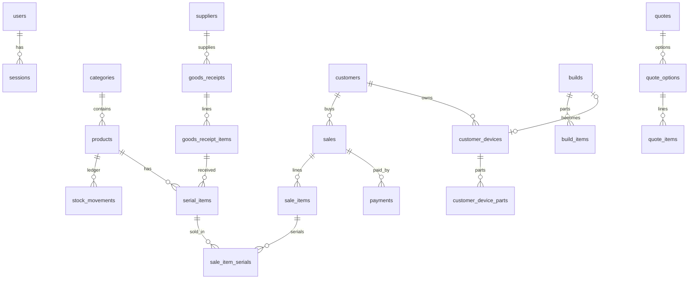

# PC Shop Manager — Plan (Phase 0)

> Status: **Revised after the owner's answers (see §1). Awaiting final approval to start Phase 1.**
> No application code has been written yet.
> Project context: this build is a **demo** for a prospective client. Tax features (VAT, tax invoices)
> are deferred to a possible paid follow-up.

---

## Contents
1. [Decisions log](#1-decisions-log)
2. [Proposals beyond the original spec](#2-proposals-beyond-the-original-spec)
3. [Tech stack and dependencies](#3-tech-stack-and-dependencies)
4. [Folder structure](#4-folder-structure)
5. [Runtime architecture](#5-runtime-architecture)
6. [Database schema](#6-database-schema)
7. [Core business logic](#7-core-business-logic)
8. [Auth and roles](#8-auth-and-roles)
9. [Main API endpoints](#9-main-api-endpoints)
10. [Screens](#10-screens)
11. [Documents, images, and Thai text](#11-documents-images-and-thai-text)
12. [Backup and restore](#12-backup-and-restore)
13. [Testing](#13-testing)
14. [Technical risks](#14-technical-risks)
15. [Phase 1 sub-tasks (one commit each)](#15-phase-1-sub-tasks)

---

## 1. Decisions log

| # | Topic | Decision | Source |
|---|---|---|---|
| Q1 | When stock changes | **Stock changes only on payment or an explicit user confirmation.** Nothing implicit: the cart, build drafts, presets, and quotes never touch stock. The actions that change stock are: confirm checkout (POS / convert quote), confirm goods receipt, confirm build assembly, confirm stock adjustment, void, and later confirm repair parts. Each one shows a confirmation dialog summarizing the stock effect. | Owner |
| Q2 | Staff entering costs on goods receipts | Staff **may enter unit costs** when receiving. A receipt saved by staff has `cost_status = 'unverified'` until the owner reviews it, and the owner can confirm or correct each line. After saving, staff can never see those costs again (write-only). Receipts created by the owner are verified automatically. Quantities and serials enter stock **immediately** when the receipt is confirmed, since the goods are physically in the shop and can be sold. The owner sees a "receipts awaiting cost review" badge. | Owner (details: my proposal, see §7.2) |
| Q3 | Costing method | Moving weighted average per product, with the cost snapshotted on each document line. Each serial item also keeps its own actual cost for reference. | Default (not objected) |
| Q4 | Tax / VAT | **Out of scope for this version.** No VAT modes, no tax invoices, no tax IDs. Prices are final prices. `shared/pricing.ts` is structured so VAT can be added later as one extra step. | Owner |
| Q5 | Receipts | The receipt is an **online document** sent to the customer (LINE/Messenger) so they can see what they bought. Output is PNG (primary) and A4 PDF. No printer support, no thermal layout, and no print button. | Owner |
| Q6 | Staff discounts | Allowed up to a percentage cap set by the owner (default 5%), enforced on the server. | Default |
| Q7 | Staff product editing | Staff can create and edit products but not the selling price or cost. A product created by staff is "awaiting price" (`price_satang = NULL`) and can't be sold until the owner sets a price. Only the owner can archive. | Default |
| Q8 | Returns | Full-bill void only. Partial returns and credit notes are deferred. | Default |
| Q9 | Payment methods | Cash (with change calculation), bank transfer/PromptPay, card (EDC, amount only), and trade-in credit. A bill can have multiple payments, which also covers deposits and outstanding balances. | Default |
| Q10 | Seed data | Optional checkbox in the first-run wizard, plus a "clear sample data" action (only allowed before any sale exists). | Default |
| Q11 | Package manager | npm workspaces | Approved |
| Q12 | Extra dependencies | The list in §3.2 | Approved |
| — | Language | Communicate with the owner in **English** from now on. App UI stays in **Thai**. Code, identifiers, and comments in English. | Owner |

---

## 2. Proposals beyond the original spec

| # | Proposal | Why |
|---|---|---|
| P1 | **Password hashing with `node:crypto` scrypt** instead of bcrypt/argon2 | No extra native module (easier Electron packaging) and still secure |
| P2 | **Cookie sessions stored in SQLite** instead of JWT | Deactivating a staff account ends their sessions immediately, and no token sits in localStorage |
| P3 | **Whitelist cost hiding:** every response is parsed through a role-specific Zod schema (the staff schema simply has no cost fields), plus an **automated test that calls every GET route as staff** and scans the whole JSON for forbidden keys | A blacklist is easy to forget. Whitelist plus the test catches leaks from new endpoints automatically. |
| P4 | **Trade-in credit is a payment method, not a discount** | Revenue stays correct, and in Phase 6 the traded-in item enters inventory with a cost equal to the credit, so profit is accurate. (It also keeps the door open for correct VAT treatment later.) |
| P5 | **Separate `payments` table** | Multiple payment methods, deposits, and paying an outstanding balance later |
| P6 | **Barcode scanner vs. Thai keyboard layout** | If Windows is set to the Thai layout, a scanner types "ๅ/-ภถุ…" instead of "12345…". When the lookup fails, the system maps Kedmanee characters back to QWERTY and retries. |
| P7 | **Scanning a serial number in the POS** adds the product with that serial preselected | Faster, and fewer wrong-serial mistakes |
| P8 | **Audit log** (void, price change, stock adjustment, cost review, restore, settings, login) | The owner can trace who did what, and it's cheap to store |
| P9 | **Automatic backup before running DB migrations** | A failed migration after an app update never loses data |
| P10 | **Offline owner password recovery:** a one-time recovery code shown at setup, plus a `npm run reset-password` CLI | There's no email to recover a password with |
| P11 | **Custom Thai line wrapping for the canvas** with `Intl.Segmenter` (built into the browser, no dependency) | Konva wraps on spaces, but Thai has no spaces between words, so Konva may split vowels and tone marks from their consonants (Phase 4) |
| P12 | **Build states draft → assembled → sold** (assembled only through an explicit confirmation, per Q1) | Supports pre-built machines on the shelf and matches the "used in build" movement type in the spec |
| P13 | Money columns always end in `_satang` (TS: `priceSatang`) | The unit is visible in the name, which prevents ×100 bugs |
| P14 | No server-side image processing (no `sharp`). The client resizes and uploads both the full image and a thumbnail. | Fewer native dependencies, and no CPU load on the shop PC |
| P15 | **Goods-receipt cost review** (Q2): staff-entered costs are provisional until the owner verifies them. Corrections adjust the average cost and are logged. | Balances staff convenience with the owner's control over cost accuracy |

---

## 3. Tech stack and dependencies

### 3.1 From the spec
TypeScript, React + Vite, Tailwind CSS, shadcn/ui, TanStack Query, React Hook Form + Zod, Fastify,
better-sqlite3 + Drizzle ORM, react-konva/Konva (Phase 4), Recharts (Phase 2), promptpay-qr, qrcode,
html-to-image, jsPDF, Vitest, @fontsource (Thai fonts)

### 3.2 Additional (approved)

| Package | Where | Purpose |
|---|---|---|
| `@fastify/cookie` | server | Session cookie |
| `@fastify/static` | server | Serve the built frontend in production |
| `@fastify/multipart` | server | Image uploads |
| `fastify-type-provider-zod` | server | Validate requests with the shared Zod schemas |
| `drizzle-kit` (dev) | server | Generate SQL migrations |
| `tsx` (dev) | server | Run TS in dev with watch |
| `esbuild` (dev) | server | Bundle the server into a single file |
| `react-router` | web | Routing |
| `@hookform/resolvers` | web | React Hook Form ↔ Zod |
| `@tailwindcss/vite` | web | Tailwind v4 plugin |
| shadcn/ui's own dependencies: `radix-ui`, `class-variance-authority`, `clsx`, `tailwind-merge`, `lucide-react`, `sonner`, `cmdk` | web | Part of shadcn/ui |
| `concurrently` (dev) | root | `npm run dev` runs server and web together |
| `eslint`, `typescript-eslint`, `eslint-plugin-react-hooks`, `prettier`, `prettier-plugin-tailwindcss` (dev) | root | Lint and format |

**I'll ask again when we reach the relevant phase:** `electron`, `electron-builder`, `@electron/rebuild`
(Phase 7), and extra post fonts such as Kanit or Prompt via @fontsource (Phase 4).

**No dependency needed for:** password hashing (`node:crypto`), backup scheduling (`setInterval`),
Thai date/B.E. formatting (`Intl.DateTimeFormat`), baht-in-words text (hand-written and tested),
Thai word segmentation (`Intl.Segmenter`), login rate limiting (in-memory), and logging (pino, which ships with Fastify).

---

## 4. Folder structure

```
d:\ComputerShop\                       (repo root, npm workspaces)
├── package.json                       workspaces: shared, server, web; scripts dev/build/start/test/lint
├── tsconfig.base.json
├── eslint.config.js / .prettierrc
├── .gitignore / .gitattributes        (LF line endings)
├── CLAUDE.md
├── docs/PLAN.md
├── data/                              ← dev data dir (git-ignored)
│
├── shared/                            used by both client and server; exported as TS source (no build step)
│   └── src/
│       ├── index.ts
│       ├── money.ts                   satang ⇄ baht, formatting, divRound
│       ├── bahttext.ts                amount in Thai words, e.g. "หนึ่งพันบาทถ้วน"
│       ├── pricing.ts                 line/bill totals, discounts, profit (pure functions)
│       ├── datetime.ts                UTC ⇄ Asia/Bangkok, B.E. years, "today"/"this month" ranges
│       ├── docNumber.ts               document number formatting
│       ├── barcode.ts                 Thai Kedmanee → QWERTY mapping
│       ├── permissions.ts             role → permission table, can(), forbidden cost keys
│       ├── enums.ts                   all status/type constants
│       ├── schemas/                   Zod request/response schemas per module
│       ├── specs/                     spec field definitions per category kind (drive forms + validation)
│       │   └── cpu.ts mainboard.ts ram.ts gpu.ts storage.ts psu.ts case.ts cooler.ts monitor.ts
│       └── compat/                    (Phase 3) compatibility rules
│           ├── types.ts registry.ts
│           └── rules/ cpuSocket.ts ramType.ts psuWattage.ts caseFormFactor.ts ...
│
├── server/
│   ├── drizzle/                       generated SQL migrations (committed)
│   ├── scripts/                       reset-password.ts, seed.ts
│   ├── test/                          integration tests (Fastify inject + in-memory SQLite)
│   └── src/
│       ├── main.ts                    CLI entry: read config → startServer()
│       ├── app.ts                     buildApp() / startServer({ dataDir, port, host }) ← Electron calls this
│       ├── config.ts                  data dir resolution, config.json
│       ├── db/
│       │   ├── schema/                Drizzle schema, one file per module
│       │   ├── client.ts              open/close/reopen connection (needed by restore)
│       │   ├── migrate.ts
│       │   └── seed/
│       ├── plugins/                   auth (session, requirePermission), error handler, static files
│       ├── lib/                       respondByRole.ts, network.ts (LAN IPs), files.ts, audit.ts
│       ├── services/                  cross-module business logic
│       │   ├── stock.service.ts       ← the ONLY code that changes stock
│       │   ├── numbering.service.ts
│       │   └── backup.service.ts
│       └── modules/                   each: routes.ts (thin) + service.ts (logic)
│           ├── auth/ setup/ users/ settings/ files/ categories/ products/
│           ├── suppliers/ goods-receipts/ stock/ serials/ backups/ audit/
│           ├── customers/ sales/ dashboard/            (Phase 2)
│           ├── builds/ quotes/ customer-devices/       (Phase 3)
│           ├── posts/                                  (Phase 4)
│           ├── repairs/ claims/                        (Phase 5)
│           └── trade-ins/                              (Phase 6)
│
└── web/
    ├── index.html  vite.config.ts
    └── src/
        ├── main.tsx  router.tsx  index.css
        ├── components/ui/             shadcn components
        ├── components/                layout, MoneyInput, MoneyText, DateText, ImageUploader, ConfirmDialog …
        ├── lib/                       api.ts, queryClient.ts, imageResize.ts, exportImage.ts, useAuth.ts
        ├── documents/                 (Phase 2+) React document components: receipt, quote, repair slip …
        └── features/                  one folder per module (pages + components + hooks)
```

**Why this split:** `shared/` holds both the Zod schemas and the business math (pricing, compat rules),
so the UI shows live totals using exactly the same code the server uses to validate on save, and the numbers
on screen and in the database always agree. `server/src/app.ts` exports `startServer()`, so Electron
(Phase 7) can import it and run everything in one process.

---

## 5. Runtime architecture

### Dev (`npm run dev`)
- `concurrently` runs two processes:
  - server: `tsx watch server/src/main.ts` on port **3300**
  - web: Vite on port **5173** (`host: true` so phones can connect), proxying `/api` and `/uploads` to 3300
- Dev data dir = `./data` in the repo root

### Production (`npm run build && npm start`)
- `web` builds to static files in `web/dist/`
- esbuild bundles `server` into `server/dist/main.js` (`better-sqlite3` stays external because it's native), and `server/drizzle/` is copied alongside it
- One process: Fastify listens on `0.0.0.0:3300` and serves `/api/*`, `/uploads/*`, and the SPA (any non-API path returns `index.html`)
- Data dir comes from the `PCSHOP_DATA_DIR` env var, otherwise `%APPDATA%\PCShopManager` (the same location Electron will use in Phase 7, so no migration is needed)

### Data dir (always separate from the app folder)
```
PCShopManager/
├── config.json         { "port": 3300 }  (optional, defaults apply)
├── shop.db             SQLite (WAL) + -wal/-shm files
├── uploads/            images named by sha256, sharded by the first 2 chars: uploads/ab/abcd…ef.jpg
├── backups/            default backup location (configurable, e.g. D:\ or a USB drive)
├── backup-state.json   last successful backup (kept outside the DB because restore replaces the DB)
└── logs/
```

### Startup sequence
1. Resolve the data dir and create missing folders
2. Open the DB with `journal_mode=WAL`, `foreign_keys=ON`, `busy_timeout=5000`
3. If migrations are pending and the DB already has data → **back up first**, then migrate
4. Check stock integrity (cache vs. ledger) and log a warning on mismatch
5. Start the backup scheduler (checks hourly whether today's backup has run)
6. Listen

---

## 6. Database schema

### 6.1 Conventions
- Primary keys: `id INTEGER` autoincrement (single shop with no sync, so UUIDs aren't needed)
- Timestamps: `INTEGER` Unix **milliseconds UTC** (Drizzle `mode: 'timestamp_ms'`). The API sends ISO-8601 UTC strings.
- Money: `INTEGER` satang, column names end in `_satang`
- Percentages/rates: `INTEGER` basis points (5% = 500)
- Enums: `TEXT` with a `CHECK` constraint (Drizzle `text({ enum })`)
- Master data (products, customers, …) is never hard-deleted; use `archived_at`
- Financial documents are never deleted; they use `status='voided'` + `voided_at`, `voided_by`, `void_reason`
- Main tables have `created_at`, `updated_at`, and `created_by` where authorship matters
- Snapshots: document lines store the name, SKU, price, cost, and warranty at the moment the document was created

### 6.2 Main relationships



### 6.3 Phase 1 tables — Foundation + Inventory

**users**
| Column | Type | Notes |
|---|---|---|
| id | int pk | |
| name | text | display name |
| username | text unique | stored lowercase |
| password_hash | text | `scrypt$N$r$p$salt$hash` |
| role | text | `owner` \| `staff` (at least one active owner must always exist) |
| is_active | int bool | |
| last_login_at, created_at, updated_at | int | |

**sessions**
| Column | Notes |
|---|---|
| id text pk | sha256 of the token (the DB stores only the hash; the cookie holds the raw token) |
| user_id → users | |
| created_at, last_seen_at, expires_at | 7-day sliding expiry |
| user_agent, ip | lets the owner see where logins come from |

**shop_settings** (single row, id=1)
`shop_name`, `logo_file_id → files`, `address`, `phone`, `line_id`, `promptpay_id`, `receipt_footer`,
`use_buddhist_era` (bool), `allow_negative_stock` (bool), `staff_max_discount_bp` (default 500),
`default_assembly_fee_satang`, `backup_dir`, `backup_keep_count` (default 14), `backup_hour` (0–23), `updated_at`

**document_sequences**
| Column | Notes |
|---|---|
| doc_type text pk | `sale`, `quote`, `goods_receipt`, `adjustment`, `repair`, `claim`, `trade_in` |
| format text | e.g. `RC{YY}{MM}-{SEQ:4}` → `RC6909-0001` (`{YY}` uses B.E. when enabled) |
| reset_policy | `never` \| `yearly` \| `monthly` |
| current_period text | e.g. `2026-09` |
| last_number int | allocated inside the same transaction as the document (no gaps or duplicates; voided docs keep their number) |

**files**
`id`, `sha256` (unique, dedup), `path`, `thumb_path`, `mime`, `size_bytes`, `width`, `height`, `created_by`, `created_at`

**categories**
`id`, `name` (e.g. "ซีพียู (CPU)"), `kind` (`cpu`|`mainboard`|`ram`|`gpu`|`storage`|`psu`|`case`|`cooler`|`monitor`|`accessory`|`service`|`other`),
`sort_order`, `is_system` (built-in, can't be archived), `archived_at`
→ `kind` decides which spec form and which compatibility rules apply. A user-created category uses `other` or maps to an existing kind.

**products**
| Column | Notes |
|---|---|
| id, sku (unique), barcode (unique, nullable) | |
| name, brand, category_id → categories | |
| condition | `new` \| `used` |
| price_satang (nullable) | NULL = "awaiting price", can't be sold |
| cost_satang | moving average cost **(owner only)** |
| warranty_months | shop warranty given to the customer |
| supplier_warranty_months | default used when receiving |
| track_stock (bool) | false for services/labor |
| serial_required (bool) | |
| min_stock | |
| on_hand | **cache** of the stock level, changed only by stock.service |
| specs (JSON text) | e.g. `{"socket":"AM5","tdpWatt":65}` |
| notes, created_by, archived_at, created_at, updated_at | |

**product_images**: `product_id`, `file_id`, `sort_order` (PK = product_id + file_id)

**suppliers**: `id`, `name`, `contact_name`, `phone`, `line_id`, `address`, `notes`, `archived_at`

**goods_receipts**
| Column | Notes |
|---|---|
| id, doc_no (unique) | |
| supplier_id, supplier_invoice_no, received_at, notes | |
| status | `posted` \| `voided` |
| cost_status | `unverified` \| `verified` (Q2). Owner-created receipts are `verified` immediately. |
| cost_verified_by, cost_verified_at | |
| total_cost_satang | owner only |
| created_by, voided_at, voided_by, void_reason | |

**goods_receipt_items**
`id`, `goods_receipt_id`, `product_id`, `qty`, `unit_cost_satang` (owner only), `line_total_satang` (owner only)

**serial_items**
| Column | Notes |
|---|---|
| id, product_id, serial_no | unique (product_id, serial_no) |
| status | `in_stock` \| `in_build` \| `sold` \| `in_claim` \| `returned_to_supplier` \| `written_off` |
| unit_cost_satang | actual cost of this unit (owner only) |
| goods_receipt_item_id | nullable (trade-ins and opening stock have none) |
| received_at, supplier_warranty_expires_at | |
| build_id | set while inside an assembled build |
| sold_sale_item_id, sold_at, shop_warranty_expires_at | set on sale |
| customer_device_id | which customer machine it's in |
| notes | |

**stock_movements** (ledger: insert-only, never updated or deleted)
| Column | Notes |
|---|---|
| id, product_id | |
| qty_change | +/− |
| type | `opening` `receive` `sale` `build_consume` `build_release` `adjustment` `return` `trade_in` `void` `repair_use` `claim_out` `claim_in` |
| ref_type, ref_id, ref_doc_no | link back to the source document |
| unit_cost_satang | owner only |
| balance_after | running balance, shown on the history page |
| reason | required for `adjustment` and `void` |
| performed_by, created_at | |

**stock_movement_serials**: `movement_id`, `serial_item_id`

**audit_logs**: `id`, `user_id`, `action` (e.g. `sale.void`, `product.price_change`, `goods_receipt.cost_verify`, `backup.restore`), `entity_type`, `entity_id`, `detail` (JSON), `created_at`

### 6.4 Phase 2 tables — POS / receipts

**customers**: `id`, `name`, `phone`, `phone_normalized` (indexed, used to warn about duplicates), `line_id`, `address` (optional), `notes`, `archived_at`, `created_at`

**sales**
| Column | Notes |
|---|---|
| id, doc_no (unique) | |
| customer_id (nullable) + customer_name/phone **snapshot** | |
| sold_at | |
| status | `paid` \| `partial` (outstanding balance) \| `voided` |
| items_total_satang | sum of lines after line discounts |
| bill_discount_satang | |
| total_satang | |
| paid_satang | cached sum of payments |
| total_cost_satang | owner only |
| source | `pos` \| `quote` \| `repair` |
| quote_id, repair_job_id (nullable) | |
| note, salesperson_id, created_at | |
| voided_at, voided_by, void_reason | |

**sale_items**
| Column | Notes |
|---|---|
| id, sale_id, parent_item_id (nullable) | build components are children of the build line |
| kind | `product` \| `build` \| `service` \| `custom` |
| product_id, build_id (nullable) | |
| name_snapshot, sku_snapshot | |
| qty, unit_price_satang, discount_satang, line_total_satang | |
| unit_cost_satang | owner only |
| warranty_months | snapshot |
| sort_order | |

> A build on a receipt: the parent line shows the machine name and total price, and the child lines list
> each part with its serial and warranty (no prices on child lines). Build cost = sum of child costs.

**sale_item_serials**: `sale_item_id`, `serial_item_id`

**payments**
`id`, `sale_id`, `method` (`cash`|`transfer`|`card`|`trade_in_credit`), `amount_satang`, `cash_received_satang`, `change_satang`,
`reference` (transfer reference), `paid_at`, `received_by`, `voided_at`

### 6.5 Phase 3 tables — Builds / quotes / upgrades

**customer_devices**: `id`, `customer_id`, `name` (e.g. "เครื่องประกอบ Ryzen 5 7600"), `build_id` (if the shop built it), `sale_id`, `notes`, `created_at`

**customer_device_parts**: `id`, `device_id`, `category_kind`, `description`, `product_id` (nullable), `serial_item_id` (nullable),
`specs` (JSON, used for compatibility checks on upgrades), `installed_at`, `removed_at` (upgrade history, rows never deleted)

**builds**
| Column | Notes |
|---|---|
| id, name | |
| type | `new` \| `upgrade` |
| status | `draft` \| `assembled` \| `sold` \| `disassembled` \| `cancelled` |
| is_preset (bool) | reusable spec set, or for sales posts |
| customer_id, customer_device_id | for upgrades |
| labor_fee_satang, discount_satang | |
| items_total_satang, total_satang | |
| total_cost_satang | owner only |
| compat_acknowledged (JSON) | rule IDs the user explicitly overrode |
| sold_sale_id, notes, created_by, created_at, updated_at | |

**build_items**: `id`, `build_id`, `product_id`, `qty`, `unit_price_satang` (snapshot), `unit_cost_satang` (snapshot, owner only), `serial_item_id` (chosen at assembly or sale), `sort_order`

**build_removed_parts** (upgrades): `id`, `build_id`, `device_part_id` (nullable), `description`, `trade_in_value_satang`

**build_photos**: `build_id`, `file_id`, `sort_order`

**quotes**: `id`, `doc_no`, `customer_id` + customer snapshot, `issued_at`, `expires_at`, `status` (`draft`|`sent`|`accepted`|`expired`|`cancelled`), `accepted_option_id`, `converted_sale_id`, `note`, `created_by`
→ `expired` is derived when reading (past `expires_at`), so no cron job is needed

**quote_options**: `id`, `quote_id`, `label` (e.g. "ตัวเลือก A: อัปเกรด"), `sort_order`, `source_build_id`, `items_total_satang`, `labor_fee_satang`, `discount_satang`, `total_satang`, `trade_in_credit_satang`, `total_cost_satang` (owner only)

**quote_items**: same shape as `sale_items` but tied to `option_id` (lines are copied from the build, so editing the build later doesn't change the quote)

### 6.6 Phase 4–6 tables (outline; details proposed at the start of each phase)

- **post_templates**: `id`, `name`, `size` (`square`|`portrait`|`story`), `design_json`, `is_builtin`, `created_by`
- **post_designs**: `id`, `name`, `size`, `template_id`, `product_id`, `build_id`, `design_json`, `preview_file_id`, `updated_at`
  - `design_json` = `{ width, height, background, elements: [{ id, type: 'text'|'image'|'rect'|'ellipse'|'badge', x, y, width, height, rotation, props, binding? }] }` where `binding` is a placeholder such as `{{price}}`
- **repair_jobs**: `id`, `doc_no`, `customer_id`, `customer_device_id`, `problem`, `accessories`, `device_password` (hidden from list views and **cleared automatically when the machine is returned**), `estimated_price_satang`, `technician_id`, `status`, `received_at`, `promised_at`, `completed_at`, `returned_at`, `sale_id`
- **repair_status_history**, **repair_photos**, **repair_parts** (stock out as `repair_use` on explicit confirmation), **repair_labor**
- **warranty_claims**: `id`, `doc_no`, `serial_item_id`, `customer_id`, `sale_id`, `supplier_id`, `problem`, `status` (`received`|`sent_to_supplier`|`returned`|`replaced`|`rejected`), `sent_at`, `returned_at`, `replacement_serial_item_id`, `notes`
- **trade_ins**: `id`, `doc_no`, seller info (name, phone, address, **national ID number/ID photo**; Thai second-hand dealer law requires recording seller identity, to be confirmed with you in Phase 6), `purchased_at`, `total_satang`, `payment_method`, `status`, `sale_id` (when used as credit)
- **trade_in_items**, **trade_in_photos**, **breakdowns** (split a used machine into parts with an owner-specified cost allocation)

---

## 7. Core business logic

### 7.1 Stock ledger
- **Single entry point:** `stockService.move(tx, { productId, qtyChange, type, ref, serialIds, unitCost, reason, userId })`, which in one transaction:
  1. reads the current `on_hand`
  2. checks for negative stock (disallowed unless `allow_negative_stock`; serial-tracked stock can **never** go negative)
  3. inserts into `stock_movements` with `balance_after`
  4. updates `products.on_hand`
  5. updates the affected serial statuses
- **Per Q1, it's called only from explicit confirmation actions:** confirm checkout, confirm goods receipt, confirm build assembly/disassembly, confirm adjustment, void, and (later) confirm repair parts, trade-ins, and claims. Carts, build drafts, presets, and quotes never call it and never reserve stock.
- better-sqlite3 transactions are **synchronous**, so they can't be interleaved. If two terminals sell the last unit at the same time, the second one reliably gets "insufficient stock". ⚠️ Never `await` inside a transaction.
- **Invariants:**
  - `products.on_hand = SUM(stock_movements.qty_change)`
  - for serial products: `on_hand = COUNT(serial_items WHERE status='in_stock')`
  - `GET /api/stock/integrity` (owner) checks both, the server checks at startup, and tests cover them

### 7.2 Cost (moving weighted average) and goods-receipt cost review
- On receipt: `newAvg = divRound(onHand × avg + qty × unitCost, onHand + qty)`. If `onHand ≤ 0`, `newAvg = unitCost`.
- **Staff receipts (Q2):** quantities and serials go into stock immediately, and the average cost is updated using the staff-entered cost **provisionally**. The receipt is `cost_status = 'unverified'`.
- **Owner review:** the owner opens the receipt and either confirms it or corrects line costs. For each corrected line:
  `delta = qty × (correctedCost − enteredCost)`. If the product's `onHand > 0`: `avg = max(0, divRound(onHand × avg + delta, onHand))`. Serial items from that line get the corrected `unit_cost_satang`.
  Sales made between receipt and review keep their provisional cost snapshot (a document snapshot is never rewritten), and the audit log records the before and after values. Then `cost_status = 'verified'`.
- A receipt where a line has no cost entered is also `unverified`. Until the owner sets one, that line uses the product's current average.
- Voiding a receipt reverses the average when the result is sensible, otherwise it keeps the current average and logs it.
- Sale, build, and quote lines snapshot `unit_cost_satang` = the average at that time.

### 7.3 Totals (`shared/pricing.ts`, pure functions with unit tests)
```
lineGross   = unitPrice × qty
lineNet     = lineGross − lineDiscount        (percent discounts are converted to satang when entered)
itemsTotal  = Σ lineNet
total       = itemsTotal − billDiscount       (no VAT in this version; see Q4)

cost        = Σ(unitCost × qty)
profit      = total − cost                    (owner only)
amountDue   = total − Σ non-voided payments   (trade_in_credit counts as a payment)
```
- Build total = Σ(part price × qty) + labor fee − build discount
- The bill discount is allocated across lines proportionally (largest-remainder method, so it sums exactly) so the best-sellers report can show per-product profit
- Staff discount cap: `(line discounts + bill discount) / itemsGross ≤ staff_max_discount_bp`, checked on the server
- Adding VAT later = one extra step after `total`, plus snapshot columns. Nothing else changes.

### 7.4 Document numbers
- Allocated inside the document's transaction. Periods (month/year) follow the **Thai (Bangkok) date**.
- Tokens: `{YYYY}` `{YY}` (B.E. or C.E. per settings), `{MM}`, `{DD}`, `{SEQ:n}`

### 7.5 Void
- Owner only, reason required, all in one transaction: set the document status → restore stock (`void` movements) → restore serial statuses → void payments → write an audit log entry
- A goods receipt can be voided only if its stock hasn't been sold (serials still `in_stock`, enough `on_hand`)

### 7.6 Serial lifecycle
```
received → in_stock ──confirm assembly──→ in_build ──sale──→ sold ──claim──→ in_claim → sold (same unit back)
             │                              └──disassemble──→ in_stock           └→ replaced: old = returned_to_supplier, new = sold
             ├──adjustment out──→ written_off
             ├──sale (direct)──→ sold
             └──void sale──→ back to in_stock (or in_build if it was part of an assembled build)
```

### 7.7 Time
- Thai time is a fixed UTC+7 with no DST, so "today" and "this month" boundaries are exact with a constant offset (`shared/datetime.ts`)
- Display via `Intl.DateTimeFormat('th-TH-u-ca-buddhist' | 'th-TH-u-ca-gregory', { timeZone: 'Asia/Bangkok' })`
- SQLite day grouping: `date(sold_at/1000, 'unixepoch', '+7 hours')`

---

## 8. Auth and roles

### 8.1 Authentication
- First run: when there are no users, every route redirects to `/setup`. `POST /api/setup` works **only while no users exist** and shows a one-time recovery code.
- Login → random 32-byte token → cookie `sid` (`HttpOnly`, `SameSite=Lax`, no `Secure` because the LAN uses plain http). The DB stores only the token hash.
- **CSRF:** non-GET requests must send the `X-PCShop: 1` header (other origins can't set it without a CORS preflight, which we never allow), in addition to SameSite=Lax
- Login throttling: 5 failures within 5 minutes per username+IP → 5-minute lockout
- Deactivating a user deletes all their sessions immediately
- `/uploads/*` requires a session (same-origin with cookies, so Konva/html-to-image canvases aren't tainted)

### 8.2 Permission matrix (`shared/permissions.ts`)
| Action | Owner | Staff |
|---|:-:|:-:|
| See cost / profit / inventory value / receipt cost totals | ✅ | ❌ |
| Create/edit products (except price and cost) | ✅ | ✅ (Q7) |
| Set/edit selling price and cost | ✅ | ❌ |
| Archive products/categories/customers/suppliers | ✅ | ❌ |
| Receive goods (enter costs write-only; receipt stays unverified) | ✅ | ✅ (Q2) |
| Review/verify goods-receipt costs | ✅ | ❌ |
| Void goods receipts / adjust stock | ✅ | ❌ |
| Sell, issue receipts, take additional payments | ✅ | ✅ |
| Discounts | ✅ unlimited | ✅ up to the cap (Q6) |
| Void sales | ✅ | ❌ |
| Builds / quotes / convert to sale / confirm assembly / post images | ✅ | ✅ |
| Delete own drafts (builds/quotes) | ✅ | ✅ |
| Repairs / warranty claims | ✅ | ✅ |
| Shop settings, users, backup/restore, audit log | ✅ | ❌ |
| View the phone-access URL + QR | ✅ | ✅ |

### 8.3 Server-side cost hiding (most important)
1. For every entity with cost data, `shared/schemas` defines `xxxStaffSchema` (no cost fields) and `xxxOwnerSchema = xxxStaffSchema.extend({...cost fields})`
2. Routes respond via `respondByRole(req, { owner, staff }, data)`, which `parse`s with the role's schema. Zod strips unknown keys, so **forgetting a field in a schema means it isn't sent**, which is the safe failure.
3. Forbidden keys are listed in `shared/permissions.ts`: `costSatang`, `unitCostSatang`, `totalCostSatang`, `lineCostSatang`, `profitSatang`, `marginBp`, `inventoryValueSatang` …
4. **Integration test:** seed every entity type → log in as staff → call every registered GET route (enumerated from Fastify automatically) → recursively scan each JSON response for forbidden keys. A new route that fails means the build fails.
5. Indirect leaks to close: sorting/filtering by cost, the dashboard, stock movement history, goods-receipt details, backup downloads (all owner-only), post data (selling price only), error messages, and the cost-review status (staff may see "unverified" but never the values)

---

## 9. Main API endpoints

Conventions: `/api` prefix, JSON, errors `{ error: { code: 'INSUFFICIENT_STOCK', message: 'สินค้าคงเหลือไม่พอ', details? } }`,
lists return `{ items, total }` and accept `?page=&pageSize=&q=`.
🔒 = owner only, (c) = cost fields stripped for staff

### Phase 1
| Method | Path | Notes |
|---|---|---|
| GET | /setup/status | installed yet? |
| POST | /setup | create owner + shop info + optional seed; returns recovery code |
| POST | /auth/login · /auth/logout | |
| GET | /auth/me | user + permissions |
| POST | /auth/change-password | |
| GET/POST | /users 🔒 | |
| PATCH | /users/:id 🔒 | name, role, active |
| POST | /users/:id/reset-password 🔒 | |
| GET | /settings | staff get the subset they need (shop name, PromptPay, discount cap …) |
| PATCH | /settings 🔒 | |
| GET/PATCH | /settings/sequences 🔒 | document number formats |
| GET | /system/network | LAN URLs (QR is rendered on the client) |
| GET | /system/info 🔒 | version, data dir |
| POST | /files | upload (multipart: image + thumb) |
| GET | /uploads/:path | session required |
| GET/POST/PATCH | /categories · /categories/:id | |
| POST | /categories/:id/archive 🔒 | |
| GET | /products (c) | `q`, `categoryId`, `condition`, `stock=low\|out\|in`, `sort` |
| GET | /products/lookup?code= (c) | exact barcode/SKU/serial match (scanners) |
| GET/POST/PATCH | /products/:id (c) | server rejects staff price/cost changes |
| POST | /products/:id/archive 🔒 | |
| PUT | /products/:id/images | image order |
| GET | /products/:id/movements (c) | |
| GET | /products/:id/serials (c) | |
| GET/POST/PATCH | /suppliers · /suppliers/:id | |
| GET | /goods-receipts (c) · /goods-receipts/:id (c) | filter `costStatus=unverified` 🔒 |
| POST | /goods-receipts | confirm receipt → stock in immediately; `cost_status` depends on role |
| POST | /goods-receipts/:id/verify-costs 🔒 | `{ lines: [{ itemId, unitCostSatang }] }` confirm/correct |
| POST | /goods-receipts/:id/void 🔒 | |
| POST | /stock/adjustments 🔒 | reason required; serials required for serial products |
| GET | /stock/movements (c) | filter by product, type, date range |
| GET | /stock/integrity 🔒 | |
| GET | /serials?q= (c) | serial search |
| GET/POST | /backups 🔒 | list / back up now |
| POST | /backups/restore 🔒 | `{ backupId }` or `{ path }` |
| POST | /seed/clear 🔒 | only before any sale exists |
| GET | /audit-logs 🔒 | |

### Phase 2
| Method | Path | Notes |
|---|---|---|
| GET/POST/PATCH | /customers · /customers/:id | search by name or phone |
| GET | /customers/:id/history (c) | purchases, devices, repairs |
| POST | /sales | confirm checkout: sale + stock out + payments in one transaction |
| GET | /sales (c) · /sales/:id (c) | `/sales/:id` returns everything needed to render the receipt |
| POST | /sales/:id/payments | additional payment |
| POST | /sales/:id/void 🔒 | |
| GET | /dashboard/summary?from=&to= (c) | sales, daily chart, best sellers, low stock; owner also gets profit, inventory value, and receipts awaiting cost review |

### Phase 3
| Method | Path | Notes |
|---|---|---|
| GET/POST/PATCH/DELETE | /builds · /builds/:id (c) | DELETE only for drafts |
| POST | /builds/check-compat | parts in → warnings out |
| POST | /builds/:id/assemble · /builds/:id/disassemble | explicit confirmation (Q1) |
| POST | /builds/:id/duplicate · /builds/:id/refresh-prices | |
| GET/POST/PATCH | /customer-devices · /customer-devices/:id | |
| GET/POST/PATCH | /quotes · /quotes/:id (c) | |
| POST | /quotes/:id/status | |
| POST | /quotes/:id/convert | `{ optionId, payments[] }`, checks stock, then creates the sale |

### Phase 4–6 (outline)
- `/post-templates`, `/post-designs`, `GET /post-context?productId=|buildId=` (public fields only, no cost)
- `/repairs`, `/repairs/:id/status`, `/repairs/:id/parts`, `/repairs/:id/close` (→ creates a sale)
- `GET /warranty/lookup?serial=|phone=`, `/claims`, `/claims/:id/status`
- `/trade-ins`, `/trade-ins/:id/breakdown`

---

## 10. Screens

Layout: sidebar on desktop, bottom nav on phones (stock lookup / photo / repairs / menu). The header has an
"open on phone" button that shows the QR code. All UI text is Thai.

| Phase | Screen | Path | Description | Primary device |
|---|---|---|---|---|
| 1 | First-run setup | /setup | wizard: owner account → shop info → sample data → recovery code | desktop |
| 1 | Login | /login | | both |
| 1 | Home | / | Phase 1: shortcuts + owner badge "receipts awaiting cost review"; Phase 2: dashboard | both |
| 1 | Products | /products | table + search + filters (category/condition/stock); below-minimum stock in red | desktop |
| 1 | Product form | /products/new, /products/:id/edit | main fields + category-specific spec form + images | desktop |
| 1 | Product detail | /products/:id | info, serials tab, movement history tab | both |
| 1 | Stock lookup | /stock/lookup | large search box, results as cards (on hand + price) | **phone** |
| 1 | Categories | /categories | | desktop |
| 1 | Suppliers | /suppliers | | desktop |
| 1 | Goods receiving | /receiving, /receiving/new, /receiving/:id | line-by-line entry, serial scan field (auto-advance, counts for you), confirm dialog; owner review/correct costs | desktop |
| 1 | Stock adjustment | /stock/adjust 🔒 | | desktop |
| 1 | Stock movements | /stock/movements | all products + filters | desktop |
| 1 | Settings › Shop | /settings/shop 🔒 | shop info, logo, PromptPay, receipt footer, discount cap, negative stock | desktop |
| 1 | Settings › Numbering | /settings/numbering 🔒 | | desktop |
| 1 | Settings › Users | /settings/users 🔒 | | desktop |
| 1 | Settings › Backup | /settings/backup 🔒 | location, keep count, "back up now", backup list + restore | desktop |
| 1 | Settings › Phone access | /settings/network | LAN URL + large QR + firewall tips | both |
| 1 | My account | /account | change password | both |
| 2 | POS | /pos | always-focused search/scan box, cart, serial picker, discounts, customer, payment, confirm checkout | desktop |
| 2 | Sales history | /sales, /sales/:id | view/export receipt PNG/PDF, add payment, void | desktop |
| 2 | Customers | /customers, /customers/:id | history, devices | both |
| 2 | Dashboard | / | | desktop |
| 3 | Builds | /builds, /builds/:id | pick parts by category, compat warnings, live totals, confirm assembly | desktop |
| 3 | Quotes | /quotes, /quotes/:id | side-by-side options, export, convert to sale | desktop |
| 3 | Upgrade calculator | /upgrade | 5-step wizard per spec | desktop |
| 4 | Sales posts | /posts, /posts/:id | gallery + editor | desktop (photo upload from phone) |
| 5 | Repairs | /repairs, /repairs/new, /repairs/:id | status board | **phone** |
| 5 | Warranty/claims | /warranty, /claims | | both |
| 6 | Trade-ins | /trade-ins, /trade-ins/new | | both |

---

## 11. Documents, images, and Thai text

- **Fonts:** all via `@fontsource`. UI: IBM Plex Sans Thai or Noto Sans Thai (variable). Documents: Sarabun.
- **Receipts, quotes, and repair slips are online documents (Q5):** React components sharing a `DocumentLayout` → rendered into a hidden DOM node → `await document.fonts.ready` → `html-to-image` produces a PNG (`pixelRatio: 2`, with `fontEmbedCSS` computed once and reused) → jsPDF `addImage` for an A4 PDF (split across pages if it's tall)
  - The PNG is sized for LINE/Messenger: 1080px wide (540px layout × pixelRatio 2), with height following the content
  - A **download** button is always the primary action (Clipboard/Share APIs don't work over http on phones)
  - No print layout or print button
- **Konva (Phase 4):** wait for fonts (`document.fonts.load`) before rendering, and wrap Thai lines yourself with `Intl.Segmenter('th', { granularity: 'word' })` + `measureText`, then pass the pre-wrapped text to Konva. Truncate only at grapheme boundaries so vowels and tone marks never separate from their consonant.
- **Standard test string:** `ผู้ใหญ่ น้ำแข็ง ที่นี่ ฟรี!` for every export path
- **Image upload:** `<input type="file" accept="image/*" capture="environment">` → client resizes with canvas to longest side ≤ 1600px, JPEG 0.82 (logos stay PNG for transparency), plus a 320px thumbnail → both uploaded in one request → the server checks magic bytes, limits size to ≤ 5MB, and names the file by sha256 (dedup)
- ⚠️ **LAN http is not a secure context:** `getUserMedia`, `navigator.clipboard`, `navigator.share`, and **`crypto.randomUUID()`** are unavailable on phones. Use `crypto.getRandomValues` if a client-side ID is ever needed.
- **Barcode scanners:** the POS/lookup search handles Enter → `/products/lookup?code=`. An exact match adds the item to the cart and clears the box. If there's no match, it retries after the Thai → QWERTY layout conversion (P6).

---

## 12. Backup and restore

**Backup format** (one folder per backup):
```
<backup_dir>/pcshop-backup-2026-09-10_2300/
├── shop.db          ← better-sqlite3 db.backup() (SQLite online backup API, safe while the DB is in use)
├── uploads/         ← full copy
└── manifest.json    { appVersion, schemaVersion, createdAt, productCount, saleCount, sizeBytes, ok: true }
```
- Written to a `….partial` folder first and renamed on success, so incomplete backups never show up in the list
- **Automatic:** an hourly check runs the backup once the configured `backup_hour` has passed and today's backup hasn't run (if the PC was off at that hour, it runs at the next start). After a successful backup, anything beyond the latest N is pruned. State is kept in `backup-state.json`.
- **Restore (owner):**
  1. Validate: open read-only → `PRAGMA integrity_check` → require `schemaVersion ≤` the app's version (a backup from a newer app version is refused)
  2. **Always back up the current state first** (safety net)
  3. Pause requests → close the DB → replace `shop.db` (removing `-wal`/`-shm`) and `uploads/`
  4. Reopen → run migrations (for older backups) → check stock integrity
  5. All sessions become invalid, so everyone logs in again
- Automated test: create data → back up → change data → restore → data matches the backup

---

## 13. Testing

- **Unit (Vitest, `shared/`):** money, divRound, bahttext, pricing (line/bill discounts, discount allocation, staff cap, profit), docNumber, datetime (Bangkok day boundaries), barcode layout mapping, compat rules
- **Integration (Vitest + Fastify `inject()` + in-memory SQLite, `server/test/`):** stock ledger (receive/sell/void/adjust keep the invariants), goods-receipt cost review (average cost correction), serial lifecycle, no negative stock, per-endpoint permissions, **no cost leak to staff**, backup/restore, unique document numbers
- **Manual:** each phase ends with a step-by-step checklist for you, including testing on a real phone
- No E2E/browser tests for now (that would need Playwright, a new dependency; we can discuss later)

---

## 14. Technical risks

| # | Risk | Impact | Mitigation |
|---|---|---|---|
| R1 | **Konva wraps Thai text wrongly** (no spaces between Thai words) | Vowels/tone marks split, lines overflow | Custom wrapping with Intl.Segmenter (P11), prototyped at the start of Phase 4 |
| R2 | **html-to-image on Safari/iOS:** images or fonts may be missing on the first render | Receipts exported from phones look wrong | Wait for `document.fonts.ready`, pre-embed fonts, do one throwaway render on Safari, test on a real iPhone |
| R3 | **Scanner with the Thai keyboard layout active** | Scans don't find products | P6 automatic layout mapping |
| R4 | **better-sqlite3 is native:** needs a prebuilt binary for the Node version (currently Node 24), and in Phase 7 a rebuild for Electron's ABI | Install fails on Windows without prebuilds (would need VS Build Tools) | Use the latest better-sqlite3 with Node 24 prebuilds; `@electron/rebuild` in Phase 7 |
| R5 | **Windows Firewall blocks port 3300 / DHCP changes the PC's IP / multiple adapters** (VirtualBox, WSL, Hyper-V) | Phones can't connect | Phone-access page lists every plausible IP (virtual adapters filtered out) with firewall/static-IP tips; Phase 7 installer adds a firewall rule |
| R6 | **Shop WiFi shared with customers** | Outsiders can reach the login page | Recommend a separate guest network, require an owner password of ≥ 8 characters, login rate limiting |
| R7 | **Indirect cost leaks** | Violates a core requirement | Whitelist schemas + route-scanning test (§8.3) |
| R8 | **Restoring while the server runs** / backups from different versions | Corrupt DB | Procedure in §12, backup before restore, tests |
| R9 | **Disk fills up** from images and daily full-copy backups | Backups fail | Client-side resizing, keep-N limit, backup page shows sizes and free space; image dedup across backups can be added later if needed |
| R10 | **Discount rounding** differs from what the shop expects | Off by 1 satang | Discounts converted to satang once, a single divRound, largest-remainder allocation, unit tests |
| R11 | **Provisional costs from staff receipts** make profit on sales made before review slightly off | Small profit inaccuracies | Owner badge for pending reviews; corrections adjust the average for remaining stock; audit log shows what changed |
| R12 | **Owner forgets the password** (offline, no email) | Locked out | Recovery code + CLI (P10) |
| R13 | **Electron: closing the window stops the server**, and phones lose access | Inconvenient | Phase 7: probably minimize to the system tray instead of quitting (will ask then) |
| R14 | **Thai characters in the Windows user path** (e.g. `C:\Users\สมชาย\AppData\…`) | DB fails to open (unlikely) | Test in Phase 7 (Node and better-sqlite3 support Unicode paths) |
| R15 | **Seed prices go stale** | Sample data doesn't match market prices | Clearly labeled as samples + clear action (Q10) |
| R16 | **HEIC photos from iPhones** or very large photos on old phones | Resize fails / out of memory | iOS converts to JPEG for file inputs; show a Thai error message if decoding fails; resize one file at a time |
| R17 | **Adding VAT later** (if the client hires further) | Rework | VAT is isolated to one step in `pricing.ts` + new snapshot columns via migration; receipts render from data, so only the layout changes |

---

## 15. Phase 1 sub-tasks

(One commit per item. Phase 1 ends with a test checklist for you.)

1. **Scaffold:** workspaces, tsconfig, eslint/prettier, Vite + Tailwind + shadcn, Fastify hello, `dev`/`build`/`start`/`test`/`lint` scripts
2. **Shared core:** money, divRound, datetime, enums, permissions + unit tests
3. **DB:** Phase 1 Drizzle schema + migrations + client (WAL, reopen) + config/data dir
4. **Auth + setup wizard:** sessions, scrypt, login/logout, rate limit, recovery code, reset-password CLI, `respondByRole`
5. **Users + audit log**
6. **Shop settings + document numbering + phone access page (LAN URL + QR)**
7. **File upload:** client-side resize + endpoint + authenticated serving
8. **Categories + spec definitions** (spec forms per kind)
9. **Products:** CRUD, search/filters, images, price-edit permissions, barcode lookup (+ Thai layout mapping)
10. **Stock service + suppliers + goods receiving (serials, confirm dialog)** + ledger integration tests
11. **Goods-receipt cost review** (owner verify/correct, average cost correction) + tests
12. **Stock adjustments + movement history + integrity check + phone stock lookup**
13. **No-cost-leak test** (every route as staff)
14. **Backup/restore:** automatic + button + restore page + tests
15. **Seed data:** 40–60 products across every category + clear action
16. **Polish + Phase 1 test checklist**
